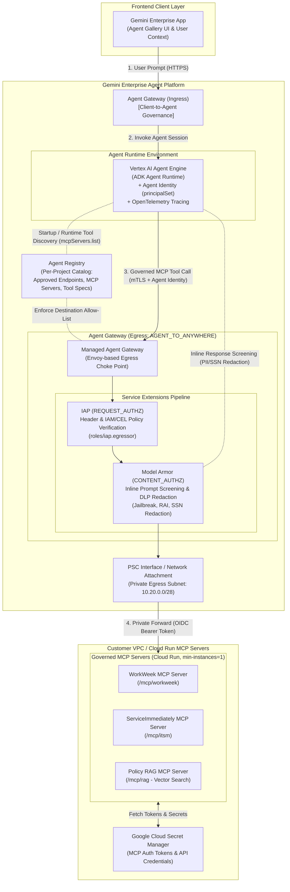
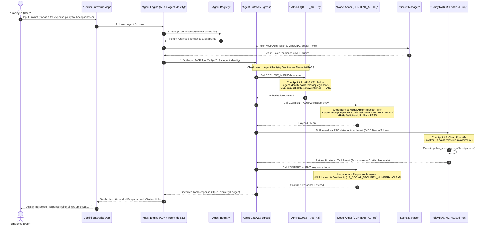
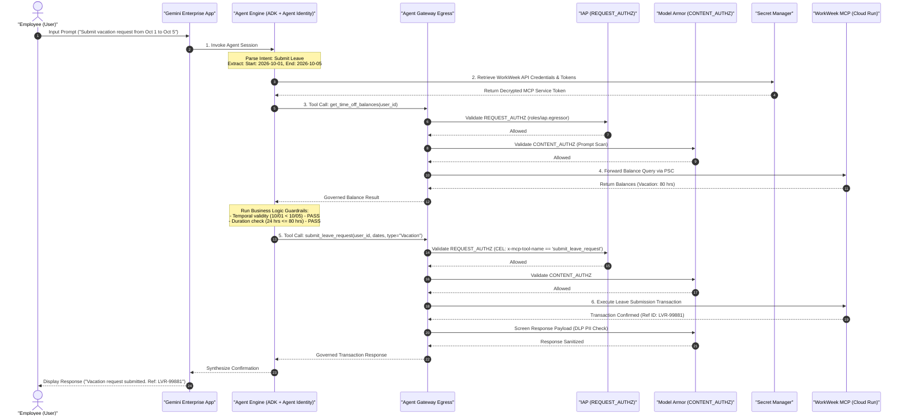
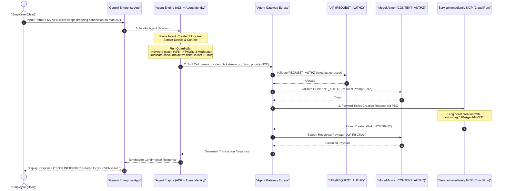

# SOLUTION DESIGN DOCUMENT

## Document Control

### Document Metadata
| Field | Value |
| :--- | :--- |
| **Author(s)** | Writer Agent (`writer_m1`) |
| **Date** | 2026-07-20 |
| **Status** | Approved |
| **Target Audience** | Engineering Team, Project Stakeholders, Security Auditors, Compliance Officers |

### Revision History
| Version | Date | Author | Description of Change |
| :--- | :--- | :--- | :--- |
| 0.1 | 2026-07-20 | Explorer Agent (`explorer_m0`) | Initial analysis and requirement mapping. |
| 1.0 | 2026-07-20 | Writer Agent (`writer_m1`) | Complete production-grade Solution Design Document. |
| 1.1 | 2026-07-20 | Lead Solution Architect | Aligned infrastructure & diagrams with Google Cloud Agent Gateway reference architecture (Gemini Enterprise App, Vertex AI Agent Engine, Agent Identity, Agent Registry, Agent Gateway Ingress/Egress, Service Extensions to Model Armor, Secret Manager for MCP tokens, GCP Well-Architected Framework). |

---

## 1. Executive Summary & Scope Boundaries

### 1.1. Business Overview & Context
Enterprise employees frequently require prompt, natural-language access to HR policy guidelines and transactional tools (such as time-off requests or support desk management). Currently, accessing these systems requires manual navigation of fragmented backend interfaces, specifically **WorkWeek** (Human Capital Management - HCM) and **ServiceImmediately** (IT Service Management - ITSM). This results in a high volume of routine Tier 1 queries and administrative tasks that consume substantial HR service desk capacity.

The **HR Agentic Solution (MVP 1)** is an intelligent, secure virtual assistant designed to automate these queries. By integrating Retrieval-Augmented Generation (RAG) for policy verification and orchestrating workflows across WorkWeek and ServiceImmediately, the solution targets a conversational, single-point entry for employee support. To meet strict enterprise standards, the solution implements traceably bounded execution, zero-trust request origin verification, and dynamic guardrails to prevent instruction overrides and data leaks.

The high-level business goals are:
- **Deflect Tier 1 Ticket Volume**: Reduce routine HR and IT helpdesk queries by at least 40% within the first six months.
- **Automate Self-Service**: Enable seamless, transactional self-service for leave submissions and incident tracking.
- **Demonstrate Cross-System Orchestration**: Validate multi-turn, multi-system action chaining for complex employee lifecycle events.
- **Ensure Bounded, Secure AI Execution**: Achieve zero data leaks, zero policy violations, and strict compliance with privacy standards.

### 1.2. Scope Boundaries

#### In-Scope for MVP 1
- **Conversational Front-End**: Web-based chat client with multi-turn conversation support and session isolation.
- **Policy Retrieval (RAG)**: Conversational search and grounding across static HR policy documents (Leave, Expenses, Remote Work, Code of Conduct).
- **WorkWeek Integration**:
  - Read actions: Fetching real-time employee profile metadata and PTO balances.
  - Write actions: Updating personal phone/address details and submitting leave requests.
- **ServiceImmediately Integration**:
  - Read actions: Querying ticket details, status, priority, and comment history.
  - Write actions: Creating incident tickets, appending comments, and resolving tickets.
- **Cross-System Orchestration**:
  - Equipment Procurement (UC-2.1): Remote policy lookup, WorkWeek status checks, and ServiceImmediately ticket dispatch.
  - Medical Leave (UC-2.2): Medical policy quoting, WorkWeek Leave of Absence entry, and ITSM mailbox access routing.
  - Relocation (UC-2.3): Relocation limit checks, WorkWeek profile updates, and facilities badge ticket creation.
- **Security & Safety Guardrails**: Input/output scanning, prompt injection/jailbreak blocking, Sensitive Personally Identifiable Information (SPII) redaction, and Role-Based Access Control (RBAC).

#### Out-of-Scope for MVP 1
- Direct integrations with databases or systems other than WorkWeek, ServiceImmediately, and the designated policy document repository.
- Support for multi-lingual input or generation (MVP 1 is English-only).
- Processing of sensitive payroll, compensation structure, or performance evaluation data.
- Voice-based interactions or telephony channels.

### 1.3. Target Architecture Overview
The target architecture implements the official **Google Cloud Agent Gateway Reference Architecture** (`codelabs.developers.google.com/cloudnet-agent-gateway`) to govern all client-to-agent and agent-to-anywhere traffic across enterprise boundaries.



#### Core Infrastructure & Architectural Components:
1. **Frontend**: **Gemini Enterprise App** (Agent Gallery) serves as the primary conversational interface, enforcing user authentication, tenant isolation, and session state rendering.
2. **Agent Runtime**: **Vertex AI Agent Engine** hosts the agent execution engine built with the **Agent Development Kit (ADK)**. It runs within a managed environment instrumented with OpenTelemetry for full execution tracing.
3. **Agent Identity & Agent Registry**:
   - **Agent Identity**: Every agent is assigned a unique cryptographic workload identity (`principalSet://agents.global.<org>.system.id.goog/aiplatform/projects/<number>`). Requests are secured end-to-end with mTLS, eliminating shared service account keys.
   - **Agent Registry**: A central per-project catalog (`mcpServers.list`) defining all approved tool specifications (`toolspec.json`), API endpoints, and MCP servers. The agent dynamically discovers tools at startup. Destinations not registered in the catalog are blocked at the gateway before outbound connection attempts.
4. **Agent Gateway Ingress & Egress**:
   - **Agent Gateway Ingress**: Governs client-to-agent access from Gemini Enterprise App to the Agent Engine.
   - **Agent Gateway Egress**: A managed gateway (`google_network_services_agent_gateway`) in `AGENT_TO_ANYWHERE` mode that acts as the single choke point for all outbound tool calls.
5. **Service Extensions to Model Armor & IAP**:
   - **IAP (`REQUEST_AUTHZ`)**: Intercepts request headers to evaluate the Agent Identity against IAM policies (`roles/iap.egressor`) and Common Expression Language (CEL) conditions (e.g., matching `x-mcp-tool-name`).
   - **Model Armor (`CONTENT_AUTHZ`)**: Provides inline content security. On outbound requests, it screens payloads for prompt injections, jailbreaks (`MEDIUM_AND_ABOVE`), and RAI violations. On return responses, it inspects structured payloads using Sensitive Data Protection (SDP/DLP) to redact PII (e.g., `US_SOCIAL_SECURITY_NUMBER`) on the fly.
6. **Backend MCP Servers & Secret Manager**:
   - **Cloud Run MCP Servers**: Hosts independent MCP tool servers (`WorkWeek MCP`, `ServiceImmediately MCP`, `Policy RAG MCP`). Configured with `min-instances=1` to prevent cold-start tool timeouts (~5s MCP timeout).
   - **Google Cloud Secret Manager**: Securely stores MCP authentication tokens, API keys, and service credentials. The impersonated invoker service account (`agent-mcp-invoker`) retrieves tokens dynamically at execution time.

### 1.4. Alternatives Considered
- **Direct LLM API Integration vs. Agent Platform**: Connecting the conversational UI directly to the Vertex AI API does not provide a mechanism for traceably bounded tool execution or runtime state tracing. An orchestration platform was selected to enforce system boundaries, maintain session isolation, and audit tool invocations.
- **Dynamic Caching of Profile Data vs. Real-Time Fetching**: Storing employee profiles and leave balances within the orchestration layer's cache would reduce API latency but introduces the risk of data drift, leading to unauthorized actions based on stale balances. To ensure transaction integrity, the architecture enforces real-time fetching directly from backend systems.
- **Synchronous vs. Asynchronous Tool Chaining**: Executing multiple API transactions synchronously inside a single request window can lead to user timeouts. A hybrid model was selected: informational queries remain synchronous, while complex transactional writes (e.g., cross-system orchestration) run asynchronously, with the agent posting status updates to the user.

---

## 2. Production-Ready Future State & Choice of Infrastructure

The production architecture replaces static functional credentials and unmanaged tool access with Google Cloud's standardized enterprise agent stack:

```
       MVP Baseline                         Production Target Infrastructure
+----------------------------+       +-----------------------------------------------+
| Standalone Custom Web UI   | ----> | Gemini Enterprise App (Agent Gallery)         |
+----------------------------+       +-----------------------------------------------+
| Basic Custom Container     | ----> | Vertex AI Agent Engine (ADK Runtime Engine)  |
+----------------------------+       +-----------------------------------------------+
| Static Service Accounts    | ----> | Cryptographic Agent Identity (principalSet)   |
+----------------------------+       +-----------------------------------------------+
| Hardcoded Tool URLs        | ----> | Agent Registry (Per-Project Catalog)          |
+----------------------------+       +-----------------------------------------------+
| Direct API Connections     | ----> | Agent Gateway Egress + Service Extensions     |
|                            |       | (IAP REQUEST_AUTHZ + Model Armor CONTENT_AUTHZ)|
+----------------------------+       +-----------------------------------------------+
| Plain Text Config / ENV    | ----> | Secret Manager (MCP Tokens & API Keys)        |
+----------------------------+       +-----------------------------------------------+
```

### 2.1. Infrastructure Choice Breakdown

1. **Frontend**: **Gemini Enterprise App** (Agent Gallery)
   - Serves as the standardized enterprise conversational UI for employees. Provides native IAM integration, workspace context retention, and multi-tenant session isolation.
2. **Agent Runtime**: **Vertex AI Agent Engine**
   - Managed serverless runtime dedicated to hosting Agent Development Kit (ADK) agent instances. Provides automated lifecycle management, state persistence, and native OpenTelemetry tracing integration.
3. **Agent Identity & Agent Registry**:
   - **Agent Identity**: Cryptographic identity (`principalSet://agents.global.<org>.system.id.goog/aiplatform/projects/<number>`) generated per agent instance. Ensures end-to-end mTLS authentication without storing static service account keys.
   - **Agent Registry**: Per-project tool catalog defining allowed endpoints, MCP servers, and tool definitions (`toolspec.json`). Enables runtime dynamic discovery (`mcpServers.list`) while automatically blocking unregistered destinations at the egress gateway.
4. **Agent Gateway (Ingress & Egress) + Service Extensions**:
   - Managed Envoy-based **Agent Gateway** operating in `AGENT_TO_ANYWHERE` mode.
   - **Service Extensions to Model Armor & IAP**:
     - **IAP (`REQUEST_AUTHZ`)**: Validates Agent Identity headers and enforces fine-grained Common Expression Language (CEL) authorization policies (`roles/iap.egressor`).
     - **Model Armor (`CONTENT_AUTHZ`)**: Performs inline prompt injection/jailbreak screening (`MEDIUM_AND_ABOVE`) on requests, and applies real-time Sensitive Data Protection (DLP) to redact PII (`US_SOCIAL_SECURITY_NUMBER`) from response payloads.
5. **MCP Servers & Secret Storage**:
   - Backend tools (`WorkWeek MCP`, `ServiceImmediately MCP`, `Policy RAG MCP`) run as isolated microservices on **Cloud Run** (`min-instances=1` to guarantee ~5s MCP initialization SLAs).
   - All MCP authentication tokens, API credentials, and TLS certificates are stored in **Google Cloud Secret Manager** and accessed securely via short-lived token minting by the invoker service account (`agent-mcp-invoker`).
6. **Framework Alignment**: Designed and operated in full accordance with the **Google Cloud Well-Architected Framework (WAF)** across Security, Reliability, Operational Excellence, Performance, Cost Optimization, and Sustainability.

---

## 3. System Flows, Sequence Diagrams & Agent Design

### 3.1. General Request Flow Sequence Diagrams

All journeys follow the **Four-Checkpoint Defense-in-Depth Model** governed by Agent Gateway, IAP (`REQUEST_AUTHZ`), Model Armor (`CONTENT_AUTHZ`), and Cloud Run IAM (`roles/run.invoker`).

#### Journey 1: HR Policy Q&A (Grounded RAG Lookup)
This diagram details the end-to-end request path for an HR policy query through Agent Gateway, IAP, Model Armor, and the Policy RAG MCP server.



#### Journey 2: Leave Request Submission (WorkWeek Transaction)
This diagram illustrates the transactional flow for requesting time off, featuring real-time balance checks, Secret Manager token retrieval, and policy verification.



#### Journey 3: IT Incident Ticket Creation (ServiceImmediately Transaction)
This diagram details log-verified IT incident creation, showing priority enforcement, duplicate mitigation, and inline DLP response sanitization.



### 3.2. Agent Design & Tool Boundaries
The conversational agent is structured as an orchestrator utilizing declarative tool definitions (Model Context Protocol / MCP) to interface with backend connectors. The agent operates within a traceably bounded sandbox, restricting execution to registered tool definitions:

- `query_policy_knowledge_base(query: str) -> dict`: Queries the vector database. Returns text chunks, citation URLs, and confidence scores.
- `get_employee_profile(employee_id: str) -> dict`: Fetches profile details (name, email, manager, work location) from WorkWeek.
- `update_contact_information(employee_id: str, address: str = None, phone: str = None) -> dict`: Updates contact coordinates in WorkWeek.
- `get_time_off_balances(employee_id: str) -> dict`: Retrieves accrued, used, and remaining balances for Vacation and Sick leave.
- `submit_leave_request(employee_id: str, start_date: str, end_date: str, type: str, work_days: int) -> dict`: Posts a leave transaction to WorkWeek.
- `get_incident_ticket_details(ticket_id: str) -> dict`: Queries ServiceImmediately for ticket status, history, and active assignee.
- `create_incident_ticket(employee_id: str, category: str, short_description: str, priority: str) -> dict`: Generates a new incident ticket in ServiceImmediately, embedding the automation origin tag.
- `post_ticket_comment(ticket_id: str, comment: str) -> dict`: Appends a comment to an active ServiceImmediately ticket.
- `update_ticket_status(ticket_id: str, status: str, resolution_notes: str = None) -> dict`: Updates the incident lifecycle status in ServiceImmediately.

---

## 4. Security, Governance & Four-Checkpoint Defense in Depth

The architecture establishes a zero-trust governance plane using Google Cloud **Agent Gateway**, **Identity-Aware Proxy (IAP)**, **Model Armor Service Extensions**, and **Secret Manager**.

```
+---------------------------------------------------------------------------------------+
|                              Checkpoint 1: Agent Registry                             |
|  - Validates target endpoint against project catalog (mcpServers.list)               |
|  - Blocks unregistered outbound hosts (e.g. pypi.org, unauthorized endpoints) at edge |
+---------------------------------------------------------------------------------------+
                                           |
                                           v
+---------------------------------------------------------------------------------------+
|                          Checkpoint 2: IAP REQUEST_AUTHZ                              |
|  - Evaluates Agent Identity (principalSet) against roles/iap.egressor                |
|  - Enforces CEL conditions (e.g. request.path.startsWith('/mcp') && tool matching)    |
+---------------------------------------------------------------------------------------+
                                           |
                                           v
+---------------------------------------------------------------------------------------+
|                       Checkpoint 3: Model Armor CONTENT_AUTHZ                         |
|  - Request: Screens for Prompt Injection & Jailbreak (MEDIUM_AND_ABOVE), RAI, URIs    |
|  - Response: DLP Sensitive Data Protection inspects & redacts SSNs / SPII on the fly   |
+---------------------------------------------------------------------------------------+
                                           |
                                           v
+---------------------------------------------------------------------------------------+
|                            Checkpoint 4: Cloud Run IAM                                |
|  - Validates OIDC token of impersonated invoker SA (agent-mcp-invoker)               |
|  - Enforces roles/run.invoker permissions; prohibits allUsers access                  |
+---------------------------------------------------------------------------------------+
```

### 4.1. Agent Identity & Secret Management
- **Cryptographic Workload Identity**: Every agent running in Vertex AI Agent Engine possesses a trackable persona (`principalSet://agents.global.<org>.system.id.goog/aiplatform/projects/<number>`). Requests to Agent Gateway use end-to-end mTLS, eliminating static service account key files.
- **Secret Manager Token Storage**: All MCP authentication tokens, API credentials, and database secrets are stored centrally in **Google Cloud Secret Manager**. Tokens are retrieved programmatically at runtime by the impersonated invoker SA (`agent-mcp-invoker`) and passed via short-lived OIDC tokens.

### 4.2. Agent Gateway & Service Extensions Configuration
The managed Agent Gateway (`google_network_services_agent_gateway`) is wired directly into the customer VPC via a dedicated private network attachment (`google_compute_network_attachment`, subnet `10.20.0.0/28`).
- **IAP Extension (`REQUEST_AUTHZ`)**: Intercepts request headers using `iap.googleapis.com`. Configured with fine-grained CEL policies:
  ```cel
  request.path.startsWith('/mcp') && request.headers['x-mcp-tool-name'] in ['query_policy', 'get_balances', 'submit_leave']
  ```
- **Model Armor Extension (`CONTENT_AUTHZ`)**: Intercepts request and response bodies via `modelarmor.<region>.rep.googleapis.com`:
  - **Outbound Request Template**: Enforces `MEDIUM_AND_ABOVE` filter on prompt injection and jailbreaks. Blocks malicious URIs and Responsible AI violations.
  - **Inbound Response Template**: Integrates Sensitive Data Protection (DLP) to scan `structuredContent` and automatically redact `US_SOCIAL_SECURITY_NUMBER` and SPII to `[REDACTED_SSN]`.

---

## 5. Integration Details & Error Handling

### 5.1. Integration Methods
- **WorkWeek (HCM)**: Connects via a secure proxy adapter executing REST/SOAP API calls. The integration leverages dedicated API endpoints for profile reading and transactional updates, using JWTs with short expiry windows for authentication.
- **ServiceImmediately (ITSM)**: Interfaces via REST APIs. Transactions pass JSON payloads mapped to incident records. The connection is authenticated using TLS client certificates to establish a cryptographically verified connection.
- **Policy Repository**: Integrates with an internal secure Document Management System (DMS) via a sync connector. Updated policies are pushed into a pipeline that extracts text, chunks content, generates vector embeddings, and updates the Vertex AI Vector Search index.

### 5.2. Integration Guardrails

#### WorkWeek Integration Guardrails (FR-3.3)
- **Balance Constraints Check**: Before invoking `submit_leave_request`, the orchestrator queries `get_time_off_balances`. If the duration of the requested leave exceeds the remaining balance for the requested category (Vacation or Sick), the operation is rejected.
- **Temporal Validity**: Validation rules ensure that the `start_date` is equal to or greater than the current date, and that the `end_date` is chronologically equal to or greater than the `start_date`.
- **Format Validation**: Profile updates must pass regex syntax checks for phone numbers (E.164 format: `^\+[1-9]\d{1,14}$`) and emails (`^[a-zA-Z0-9._%+-]+@[a-zA-Z0-9.-]+\.[a-zA-Z]{2,}$`) before execution.
- **API Latency & Rate Limits**: While the system fetches live PTO balance data directly from WorkWeek for each leave transaction, static employee profile details are cached using a short-lived (5-minute TTL), session-scoped cache to prevent hitting WorkWeek API rate limits and minimize latency.
- **Public Holiday & Weekend Leave Logic**: The duration of a requested leave is verified by delegating the work days calculation directly to WorkWeek's native holiday/calendar API (rather than attempting local calendar logic in the orchestrator) to correctly account for company-specific public holidays, regional calendars, and weekend exclusions.

#### ServiceImmediately Integration Guardrails (FR-4.3)
- **Transition Constraints**: Status updates must follow a logical lifecycle path: `New` -> `Assigned` -> `In Progress` -> `Resolved` -> `Closed`. Requests attempting to skip states (e.g., transitioning directly from `New` to `Closed` or `Resolved`) are rejected.
- **Duplication Mitigation**: The connector checks for active incident records created by the same user ID within the past 15 minutes. If a ticket matching the same category and description is found, the system blocks the duplicate submission and redirects the user to the active ticket.
- **Priority Verification**: Incidents are scanned for keywords (e.g., "outage", "system down", "security breach") and cross-referenced with categories to automatically enforce correct priority levels, preventing users from flagging routine requests as 'Critical'.
- **Priority Escalation Abuse Control**: Before final ticket creation, the conversational interface displays the automatically assigned priority to the user and prompts them to confirm the priority level. If the user overrides the automatically assigned priority, the system triggers an audit logging hook to record the user's justification and flag the override for IT service manager audit.

#### Policy Retrieval Guardrails (FR-5.4)
- **Strict Grounding**: The RAG engine requires a vector retrieval similarity score above `0.75`. If the search return yields results below this threshold, the model is restricted from generating a response and must state that it cannot find the policy detail.
- **Domain Containment**: Incoming prompts are classified before RAG lookup. If the prompt does not align with HR policy domains (e.g., asking for programming help or general knowledge), it is blocked.
- **Citation Integrity**: Every output generated from policy documents must contain a structured `source_metadata` block matching the source document name, section ID, and a valid deep link.

### 5.3. Error Handling and Fallbacks
- **Graceful Failure (NFR-4.1)**: If a backend API is unresponsive, the orchestrator intercepts the error code (e.g., 504 Gateway Timeout) and returns a standard message: *"The integration service is temporarily unavailable. Please try again later or contact HR Support directly."* No stack traces or debugging logs are shown to the user.
- **Transient Fault Tolerance (NFR-4.2)**: API clients implement retry policies with exponential backoff. The system retries failed calls up to 3 times (initial delay of 500ms, scaling by a factor of 2, with jitter) for transient codes (e.g., 429 Rate Limit, 502 Bad Gateway).
- **Orchestration Consistency (NFR-4.3)**: If a step fails mid-sequence during a cross-system workflow (e.g., a leave request is posted in WorkWeek, but the corresponding manager notification ticket fails to create in ServiceImmediately), the orchestrator executes a compensating action to roll back the WorkWeek transaction, and creates a high-priority system alert to notify administrators of the partial failure.

---

## 6. Cost Estimation & FinOps

Managing operational costs involves monitoring token usage, data hosting, and API volumes.

| Component | Cost Driver | Unit Metric | Optimization Strategy |
| :--- | :--- | :--- | :--- |
| **Model Inference** | Vertex AI Gemini API (Input/Output tokens) | Per 1K Tokens | Implement system prompt caching and context pruning during multi-turn chats. |
| **Safety Scanning** | Vertex AI Model Armor | Per Million Characters | Execute input scanning sequentially and cache safety validation decisions. |
| **Policy Vector Store** | Vertex AI Vector Search Index | Per Gigabyte / Query Volume | Set index update frequencies and optimize chunk overlap sizes to reduce duplicate vectors. |
| **Logging & PII Redaction** | Sensitive Data Protection API | Per Gigabyte scanned | Apply pre-filtering to scan only transactional logs containing PII, bypassing static logs. |

---

## 7. Deployment & Delivery Plan

Deployment is structured across five sequential milestones to validate components before system integrations:

```
[Milestone 1] Ingestion & RAG
     |
     v
[Milestone 2] API Integrations (WorkWeek & ServiceImmediately)
     |
     v
[Milestone 3] Orchestration Chaining (Cross-System Use Cases)
     |
     v
[Milestone 4] Security Guardrails & Safety Scanning
     |
     v
[Milestone 5] UAT Validation & Deployment Sign-off
```

- **Milestone 1: Ingestion & RAG Validation**
  - Provision Vector Search infrastructure.
  - Ingest, chunk, and index HR policies.
  - Verify grounding accuracy and citation rendering.
- **Milestone 2: API Integrations**
  - Implement WorkWeek and ServiceImmediately connector clients.
  - Configure connections using functional test credentials.
  - Verify basic read/write operations against dev systems.
- **Milestone 3: Orchestration Chaining**
  - Deploy the AI Orchestrator service.
  - Implement intent parsing, conversation tracking, and the cross-system use cases (UC-2.1, UC-2.2, UC-2.3).
  - Verify transaction sequencing.
- **Milestone 4: Security Guardrails & Safety Scanning**
  - Integrate Vertex AI Model Armor for input/output checking.
  - Configure GCP Sensitive Data Protection (DLP) log scanning.
  - Configure IAM roles, GKE network policies, and IAP boundaries.
- **Milestone 5: UAT Validation & Deployment**
  - Conduct full performance evaluation against the UAT test suite.
  - Validate security controls.
  - Sign off on compliance and promote to the staging environment.

---

## 8. Assumptions, Constraints, Risk & Mitigations

### 8.1. Assumptions
- The source HR policy documents are updated, reviewed, and approved for RAG consumption.
- Stable, dedicated test environments for WorkWeek and ServiceImmediately are available throughout the implementation lifecycle.
- The downstream systems have sufficient throughput to handle the volume of automated API requests.

### 8.2. Constraints
- **Document Sync Latency**: Policy changes made in the document management system must propagate and index within exactly **4 hours** (as per FR-5.5).
- **Single-Tenancy**: The application is deployed in a single-tenant environment, isolating data from other organizational business units.
- **Authentication**: MVP 1 excludes Single Sign-On (SSO) integration, relying on mock functional test credentials.

### 8.3. Risks & Mitigations
- **Risk: Indirect Prompt Injection**: A user could trigger a policy Q&A query containing instructions that bypass downstream tool parameters.
  - *Mitigation*: The system parses the user prompt and extracts parameters using structured entity extraction, passing only verified parameters to API client modules rather than raw string payloads.
- **Risk: Inconsistent Transaction State**: An orchestration workflow fails midway, leaving systems in an out-of-sync state (e.g., leave requested but no tracking ticket created).
  - *Mitigation*: Implement transactional compensation logic that rolls back changes or creates an alert ticket for immediate manual review upon transaction failure.
- **Risk: Leakage of PII in Logs**: User-submitted details could be captured in execution trace logs.
  - *Mitigation*: Route all log streams through a pipeline that invokes the Cloud SDP (DLP) API to redact PII prior to writing to long-term storage.

---

## 9. Quality Evaluation & UAT Framework

UAT verification will evaluate the system against the predefined success criteria from the BRD.

### Acceptance Criteria Metrics
| success Metric / Category | Target Threshold | Verification Method |
| :--- | :--- | :--- |
| **Policy Q&A Accuracy** | **>= 95%** accuracy on benchmark query suite; **0%** policy hallucinations. | Execute automated test suite using a golden dataset of 200 policy questions; verify semantic correctness. |
| **Deflection Rate** | **>= 40%** deflection of routine Tier 1 ticket volume within 6 months. | Measure and analyze helpdesk ticket volume before and after rollout to verify deflection. |
| **Transaction Integrity** | **100%** correctness (no data corruption or unauthorized updates). | Execute transaction validation scripts across WorkWeek and ServiceImmediately records. |
| **Response Latency** | Average latency **< 10.0 seconds** per turn. | Measure end-to-end response times under simulated concurrent user loads. |
| **Safety Scan Overhead** | Latency overhead **< 300ms** per turn. | Measure latency delta with safety scanning enabled vs. disabled. |
| **Safety & Guardrail Efficacy** | **100%** detection of known prompt injection/jailbreak test cases; **< 1%** False Positives (blocking legitimate queries). | Execute standard penetration test cases and verify blocking effectiveness vs false-positive triggers. |
| **System Availability** | **99.9%** uptime SLA. | Continuous monitoring of system availability using GCP Cloud Monitoring. |
| **Auditability & Traceability** | **100%** log coverage of API calls and safety blocks. | Audit log validation to verify the presence of request origin tags and blocked transaction attempts. |

---

## 10. Google Cloud Well-Architected Framework (WAF) Alignment

The solution architecture is designed, evaluated, and operated in strict alignment with the six pillars of the **Google Cloud Well-Architected Framework**:

| WAF Pillar | Design Principle & Recommendation | Solution Implementation Details |
| :--- | :--- | :--- |
| **1. Security** | Implement Security by Design & Zero Trust; Use AI Securely and Responsibly. | - Cryptographic **Agent Identity** (`principalSet`) eliminates static keys.<br>- Four-checkpoint defense in depth via **Agent Gateway**.<br>- Inline **Model Armor** prompt injection screening and **DLP** PII redaction.<br>- Secret storage via **Google Cloud Secret Manager**.<br>- Private egress via **PSC Network Attachment** (`10.20.0.0/28`). |
| **2. Reliability** | Design for High Availability & Fault Tolerance; Manage Capacity and SLA. | - Cloud Run MCP servers configured with `min-instances=1` to guarantee ~5s MCP initialization SLAs.<br>- Automatic retries with exponential backoff and jitter.<br>- Cross-system transactional compensation logic on failed workflows. |
| **3. Operational Excellence** | Automate Deployment with IaC; Comprehensive Tracing and Observability. | - Fully automated IaC provisioning using **Terraform**.<br>- **OpenTelemetry** end-to-end trace spans across Agent Engine -> Agent Gateway -> IAP -> Model Armor -> Cloud Run MCP.<br>- Audit logging via Cloud Logging with `Authz-DryRun-Decision` verification. |
| **4. Performance Optimization** | Optimize Network Latency & Resource Utilization. | - Dedicated PSC network attachment avoids public internet hops.<br>- Structured content payloads (`structuredContent`) for predictable, low-latency DLP scanning.<br>- Session-scoped 5-minute caching for static employee profile metadata. |
| **5. Cost Optimization** | FinOps & Workload Rightsizing. | - Serverless execution model (Vertex AI Agent Engine & Cloud Run).<br>- System prompt caching to reduce token consumption on Gemini API.<br>- Target DLP inspect rules focused strictly on sensitive infoTypes (`US_SOCIAL_SECURITY_NUMBER`). |
| **6. Sustainability** | Reduce Environmental Impact of Compute Workloads. | - Serverless auto-scaling minimizes idle compute overhead.<br>- Workload deployment hosted in carbon-neutral Google Cloud regions. |

---

## 11. Assumptions & Resolved Open Questions

1. **Frontend Interface Choice**:
   - **Resolution**: Aligned with enterprise standards, the solution utilizes **Gemini Enterprise App** (Agent Gallery) as the primary user interface.
2. **Document Sync Latency Parameter (FR-5.5)**:
   - **Resolution**: The sync latency is set to exactly **4 hours** to meet operational requirements for propagating updated HR policy documents to Vector Search.
3. **MCP Server Warm Instances & SLA**:
   - **Resolution**: Cloud Run MCP instances enforce `min-instances=1` to eliminate 15s cold starts and satisfy the ~5s MCP initialization timeout.
4. **Compensating Action Workflow Detail**:
   - **Resolution**: If an automated rollback fails during a cross-system orchestration, the system immediately dispatches a priority IT ticket in ServiceImmediately, alerts the HR Operations team, and returns a sanitized error response to the user.
