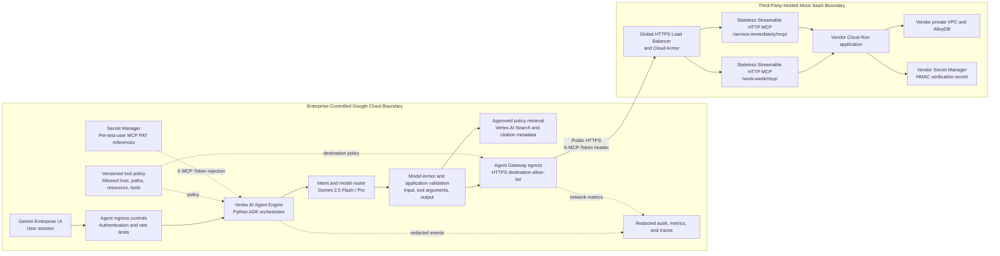

# SOLUTION DESIGN DOCUMENT

## Document Control

### Document Metadata

| Field | Value |
| :--- | :--- |
| **Document** | HR Agentic Solution — MVP 1 |
| **Author(s)** | Solution Architecture Team |
| **Version** | 1.2 |
| **Date** | 2026-07-20 |
| **Status** | Under Review |
| **Target Audience** | Engineering, Product, HR Operations, IT Service Management, Security, Privacy, Compliance, SRE, and the third-party MCP service owner |
| **Business Requirements** | [HR Agentic Solution BRD](<HR Agentic Solution BRD.pdf>) |
| **Design Template** | [Enterprise Agentic Solution Design Document](<Enterprise Agentic Solution Design Document .pdf>) |
| **Third-Party Architecture** | [Mock SaaS Architecture](<project-specs/Mock SaaS Architecture.pdf>) |
| **Third-Party Contract** | [Mock SaaS MCP OpenAPI](<project-specs/Mock SaaS MCP openapi.json>) |

### Revision History

| Version | Date | Author | Description of Change |
| :--- | :--- | :--- | :--- |
| 0.1 | 2026-07-20 | Discovery Team | Initial BRD analysis and requirement mapping. |
| 1.0 | 2026-07-20 | Solution Architecture Team | Initial end-to-end solution design. |
| 1.1 | 2026-07-20 | Lead Solution Architect | Added Google Cloud agent-platform and governance components. |
| 1.2 | 2026-07-20 | Solution Architecture Team | Corrected the MCP trust boundary to third-party hosting; aligned endpoint paths, authentication, resources, tools, guardrails, failure handling, UAT, and open questions with the supplied BRD and vendor specification. |

---

## 1. Executive Summary & Scope Boundaries

### 1.1. Business Overview & Context

Employees currently navigate separate HR policy repositories, WorkWeek HCM screens, and ServiceImmediately ITSM screens for routine questions and transactions. The resulting fragmented experience increases Tier 1 ticket volume and delays common activities such as checking leave balances, submitting time off, updating contact information, and managing incidents.

The HR Agentic Solution provides one conversational entry point for policy questions and authorized self-service actions. An ADK-based agent running on the Gemini Enterprise agent platform grounds policy answers in approved sources and invokes two externally hosted Model Context Protocol (MCP) services for WorkWeek and ServiceImmediately. The enterprise owns the user experience, agent, security controls, policy retrieval system, outbound governance, audit records, and MCP credentials. A third party owns and operates the mock SaaS load balancer, Cloud Armor policy, MCP application, Cloud Run services, VPC, database, and server-side token verification.

MVP 1 has the following measurable goals:

- Reduce routine Tier 1 HR and IT ticket volume by at least 40% within six months.
- Achieve at least 95% accuracy on the approved policy benchmark with no hallucinated policy facts.
- Execute supported transactions with 100% correctness and no unauthorized cross-user access.
- Begin generating responses within 10 seconds, with safety scanning adding no more than 300 ms per turn under the agreed test load.
- Log every allowed and denied action with an unambiguous automation origin, while excluding credentials and redacting sensitive personal information.

### 1.2. Scope Boundaries

#### In Scope for MVP 1

- English-language conversational access through the Gemini Enterprise UI, with isolated multi-turn sessions.
- Policy Q&A over approved HR documents, including grounding, refusal when evidence is insufficient, and clickable document/section citations.
- WorkWeek MCP capabilities supplied by the third party:
  - Resolve the employee associated with the authenticated MCP context.
  - Read employee profile and Vacation/Sick balances without caching employee data in the agent layer.
  - Update home address and phone number.
  - Submit Vacation or Sick time-off requests.
- ServiceImmediately MCP capabilities supplied by the third party:
  - List the authenticated employee's tickets and retrieve ticket detail resources.
  - Create tickets, add comments, and update status using the supported state machine.
- Cross-system orchestration only where all required policy data, profile fields, and MCP operations exist and pass authorization and UAT.
- Input/output safety screening, prompt-injection defenses, allow-listed tool execution, credential protection, PII redaction, RBAC, audit logging, monitoring, and graceful failure handling.
- Single-tenant MVP operation using controlled functional test identities and third-party personal access tokens (PATs). Enterprise SSO delegation to the third party is not included in MVP 1.

#### Out of Scope for MVP 1

- Hosting, configuring, deploying, scaling, patching, or directly observing the third-party WorkWeek and ServiceImmediately MCP infrastructure.
- Direct database access to the third-party AlloyDB environment.
- Runtime use of the vendor REST endpoints unless separately approved through architecture, security, and contract change control. The runtime integration described in this document uses MCP.
- Payroll, compensation, performance review, voice, multilingual, and multi-tenant capabilities.
- Automatic cancellation or correction of a leave request because the supplied MCP toolset has no compensation tool.

#### Known BRD-to-Contract Gaps

The following are BRD requirements or use-case dependencies that the supplied MCP contract cannot currently satisfy. They are release blockers for the affected acceptance tests, not silently removed scope:

- The WorkWeek profile resource does not document the BRD-required `department` and `hire date` fields or the remote-work status needed by UC-2.1.
- The WorkWeek MCP toolset supports Vacation and Sick requests but not the Leave of Absence operation needed by UC-2.2.
- The WorkWeek MCP toolset has no corporate holiday/calendar operation for authoritative work-day calculation.
- The WorkWeek MCP toolset has no cancel/correct request tool for automated compensation.
- Vendor response schemas, idempotency behavior, rate limits, complete error codes, and production SLA are not supplied.

### 1.3. Target Architecture Overview



The third-party MCP origin is `https://mock-saas.aishprabhat.demo.altostrat.com`. The enterprise egress policy permits only TCP 443 to that exact host and the two MCP path prefixes. The vendor specification states that MCP traffic bypasses IAP and authenticates with `X-MCP-Token`; therefore the design does not use PSC, an OIDC bearer token, `roles/run.invoker`, or enterprise control of Cloud Run minimum instances for these external services. IAP/IAM may still protect enterprise-controlled ingress and administration but are not asserted at the vendor MCP endpoint.

Policy retrieval remains inside the enterprise boundary. It is not part of the third-party MCP contract and is independently governed, indexed, evaluated, and monitored.

#### Core Responsibilities

| Responsibility | Enterprise | Third Party |
| :--- | :---: | :---: |
| User/session authentication and agent authorization | Accountable | — |
| Intent classification, model selection, confirmation, and orchestration | Accountable | — |
| Policy ingestion, grounding, and citations | Accountable | — |
| MCP PAT storage, user-to-token mapping, injection, and rotation coordination | Accountable | Supports issuance/revocation |
| Outbound host/path allow-list and content controls | Accountable | — |
| Load balancer, Cloud Armor, MCP availability, Cloud Run, VPC, and AlloyDB | — | Accountable |
| Tool/resource ownership enforcement | Verifies before call | Enforces authoritatively |
| End-to-end audit correlation | Accountable | Supplies agreed correlation/error data |

### 1.4. Alternatives Considered

| Decision | Selected Option | Alternatives and Rationale |
| :--- | :--- | :--- |
| External integration protocol | MCP Streamable HTTP using the supplied resources and tools | Direct REST was rejected for the agent runtime because it bypasses MCP discovery and duplicates server guardrails. It remains an administrative surface only if separately approved. |
| MCP hosting | Third-party hosted public HTTPS service | Customer-hosted Cloud Run was rejected because it contradicts the supplied architecture and ownership model. Private connectivity can be reconsidered only if the vendor offers a documented private endpoint. |
| Authentication | Vendor PAT in `X-MCP-Token`, stored by reference in Secret Manager | OIDC/IAP and mTLS client-certificate authentication were rejected because the vendor MCP contract does not accept them. Hard-coded tokens and plaintext environment files are prohibited. |
| Employee data caching | No employee profile or balance cache | A session cache could reduce latency but violates BRD FR-3.4 and risks stale authorization/business decisions. |
| Tool execution | Exact versioned allow-list plus runtime MCP discovery validation | Unbounded dynamic tool use was rejected because a newly exposed vendor tool must not become automatically callable without review. |
| Model routing | Gemini 2.5 Flash for routine classification/synthesis; Gemini 2.5 Pro for approved complex reasoning | A single Pro route increases latency/cost; a single Flash route may reduce performance on multi-document or multi-step reasoning. Transactions remain deterministic regardless of model. |
| Write recovery | Confirmation, no blind retry, reconciliation, and manual follow-up | Automatic rollback was rejected because the MCP contract has no cancel/correct-leave tool and blind retries can duplicate writes. |

---

## 2. Production-Ready Future State Design

### 2.1. Component and Technology Decisions

| Layer | Production Design | Key Configuration |
| :--- | :--- | :--- |
| Experience | Gemini Enterprise UI | Authenticated access, isolated sessions, explicit confirmation before consequential writes, accessible citations and status messages. |
| Agent runtime | Vertex AI Agent Engine with Python ADK | Versioned agent package, bounded tools, structured state, deadlines, correlation IDs, OpenTelemetry instrumentation, and no credential values in state. |
| Model routing | Gemini 2.5 Flash and Gemini 2.5 Pro on Vertex AI | Flash handles intent, parameter extraction, simple policy synthesis, and confirmations. Pro is used only for complex multi-document or cross-system planning after safety checks. Model selection is logged without raw prompts. |
| Policy retrieval | Vertex AI Search over approved HR sources | Source ACL ingestion, section-aware chunks, stable document IDs, active-link validation, confidence/evidence checks, and incremental synchronization. The sync target remains an open business decision. |
| Safety | Model Armor plus deterministic application validation | Inspect user input before routing; validate tool arguments against schemas and identity; inspect model/tool-derived text before display; apply DLP to prompts, state, logs, and traces. |
| Egress governance | Agent Gateway and application tool policy | Allow only the vendor hostname, HTTPS, the two exact MCP path prefixes, approved MCP methods, and approved resources/tools. Block all other destinations and newly discovered capabilities by default. |
| Secret management | Google Cloud Secret Manager | Store one secret version per controlled PAT mapping where supported; least-privilege accessor identity; rotation/revocation runbook; never expose the token to the model, browser, logs, or traces. |
| Asynchronous state | Durable enterprise-controlled workflow store | Store correlation ID, verified user reference, step state, timestamps, and redacted results only. Long-running work returns a tracking response and never retains PATs or unnecessary HR data. |
| Observability | Cloud Logging, Monitoring, Trace, and alerting | Trace only the enterprise-controlled path; record vendor call duration/result and correlation IDs. Do not claim internal vendor spans unless the vendor supplies them. |

### 2.2. Model Routing and Deterministic Boundaries

The router first classifies the request as policy Q&A, WorkWeek read/write, ServiceImmediately read/write, supported cross-system intent, or unsupported/off-topic. Routine single-domain turns use Gemini 2.5 Flash. Gemini 2.5 Pro is permitted only when the request requires multi-document reasoning or an approved cross-system plan. The router falls back to Flash if the Pro route is unavailable and the request can be completed without reducing correctness; otherwise it reports temporary unavailability.

Models never decide authorization, employee identity, allowed state transitions, balance sufficiency, input formats, or whether a write succeeded. Those decisions are made by authenticated context, schemas, deterministic policy code, and authoritative MCP responses. A model proposes a tool call; the tool policy validates and either executes or rejects it.

### 2.3. Reliability, Scalability, and Service Levels

- Enterprise components are deployed across managed regional capacity with autoscaling and release health checks appropriate to the selected Google Cloud services.
- Every vendor call has a connection timeout, response deadline, total turn budget, and circuit breaker. Final values are established during performance testing and must keep time-to-first-response within the BRD threshold.
- Read-only calls may be retried for transient failures with bounded exponential backoff and jitter. Consequential writes are not blindly retried after an ambiguous result.
- The enterprise monitors synthetic MCP initialization, resource reads, tool calls in a non-destructive test tenant, vendor latency, authentication failures, schema drift, and circuit-breaker state.
- The BRD 99.9% end-to-end availability target includes the third-party dependency. It cannot be committed until the vendor supplies an availability objective, maintenance policy, support escalation, and recovery terms that permit the composite target.
- The enterprise cannot guarantee or configure vendor Cloud Run minimum instances, database availability, or edge capacity. These are vendor service-level dependencies.

### 2.4. Data Lifecycle

- Employee profile and leave balance data is fetched from WorkWeek for every query and is not cached in the orchestration layer.
- Conversation state stores only the minimum redacted information needed for the current session and is isolated by authenticated session and tenant.
- Raw MCP payloads containing personal data are not written to general-purpose logs. Audit events record field names, decision outcomes, hashed/pseudonymous subject references, timestamps, tool names, and correlation IDs.
- Retention, residency, deletion, legal basis, and data-processing agreement requirements remain subject to Privacy and Legal approval in Section 10.

---

## 3. System Flows, Sequence Diagrams & Agent Design

### 3.1. Request Pre-Processing and Tool Boundary

Every turn follows this order:

1. Validate the authenticated enterprise session and create a correlation ID.
2. Inspect the input for prompt injection, jailbreaks, unsafe content, malicious URLs, and sensitive data handling requirements.
3. Classify intent and select Flash or Pro under the routing policy.
4. Resolve user identity from trusted session/token mapping; never accept an employee ID from the prompt as proof of identity.
5. Retrieve policy evidence or propose an MCP resource/tool call.
6. Validate the proposed host, path, capability name, arguments, ownership, state transition, and confirmation requirement.
7. Retrieve the PAT by secret reference and inject `X-MCP-Token` outside model-visible context.
8. Execute with a deadline and capture a redacted audit result.
9. Inspect returned text and the final response for sensitive or unsafe output.
10. Return grounded information, a confirmed transaction reference, or a clear non-technical failure message.

The approved third-party MCP catalog is:

| Server | MCP Resources | MCP Tools |
| :--- | :--- | :--- |
| WorkWeek `/work-week/mcp/` | `workweek://employees/{employee_id}/profile`; `workweek://employees/{employee_id}/timeoff` | `get_current_employee_id()`; `get_employee_balances(employee_id)`; `request_time_off(employee_id, start_date, end_date, leave_type, days)`; `update_personal_info(employee_id, address, phone)` |
| ServiceImmediately `/service-immediately/mcp/` | `serviceimmediately://tickets/{ticket_id}` | `list_tickets(employee_id)`; `create_ticket(requested_by, category, short_description, priority, assignment_group='Service Desk')`; `add_ticket_comment(ticket_id, author, comment)`; `update_ticket_status(ticket_id, status, resolution_notes='', updated_by='System')` |

MCP initialization and `list_tools`/resource discovery are used to verify that the live server matches this approved catalog. Discovery does not grant authorization: unknown, renamed, or schema-changed capabilities are blocked and raise a contract-drift alert.

### 3.2. Journey 1 — HR Policy Q&A

```mermaid
sequenceDiagram
    autonumber
    actor U as Employee
    participant UI as Gemini Enterprise UI
    participant A as ADK Agent
    participant S as Safety and DLP Controls
    participant R as Model Router
    participant K as Vertex AI Search
    participant L as Audit Log

    U->>UI: Ask an HR policy question
    UI->>A: Authenticated turn and correlation ID
    A->>S: Inspect input
    alt Unsafe, injected, or off-topic
        S-->>A: Block with reason code
        A->>L: Redacted denied-action event
        A-->>UI: Safe refusal
    else Allowed
        S-->>A: Allowed
        A->>R: Classify and select Flash or Pro
        R-->>A: Approved model route
        A->>K: Search approved policy corpus
        K-->>A: Evidence chunks and citation metadata
        alt Insufficient evidence or invalid citation
            A->>L: Grounding refusal event
            A-->>UI: Policy answer not found; provide HR support path
        else Sufficient verified evidence
            A->>S: Inspect grounded draft and citations
            S-->>A: Sanitized response
            A->>L: Redacted success and source IDs
            A-->>UI: Grounded answer with clickable citations
        end
    end
```

### 3.3. Journey 2 — WorkWeek Leave Request

```mermaid
sequenceDiagram
    autonumber
    actor U as Employee
    participant UI as Gemini Enterprise UI
    participant A as ADK Agent
    participant P as Tool Policy
    participant SM as Secret Manager
    participant G as Egress Gateway
    participant W as Third-Party WorkWeek MCP
    participant L as Audit Log

    U->>UI: Request Vacation or Sick leave
    UI->>A: Authenticated session and requested dates
    A->>P: Validate intent, dates, leave type, and supported capability
    P-->>A: Allowed; user confirmation required
    A->>SM: Resolve PAT for trusted test-user mapping
    SM-->>A: Secret reference materialized outside model context
    A->>G: Initialize /work-week/mcp/ with X-MCP-Token
    G->>W: Streamable HTTP MCP connection
    W-->>A: Initialized and approved catalog verified
    A->>W: get_current_employee_id()
    W-->>A: Authenticated employee ID
    A->>W: get_employee_balances(employee_id)
    W-->>A: Current Vacation and Sick balances
    A->>P: Validate ownership, chronology, balance, and agreed days
    alt Validation fails or work-day count is unresolved
        P-->>A: Reject without write
        A->>L: Redacted rejection event
        A-->>UI: Explain correction or request required information
    else Validation passes
        A-->>UI: Show exact leave type, dates, days, and request confirmation
        U->>UI: Confirm
        UI->>A: Confirmation bound to correlation ID and payload hash
        A->>W: request_time_off(employee_id, start_date, end_date, leave_type, days)
        alt Confirmed response
            W-->>A: Success and request reference/result
            A->>L: Automation-on-behalf-of-user success event
            A-->>UI: Confirm submission
        else Timeout or ambiguous write result
            A->>L: Unknown-outcome event; no blind retry
            A-->>UI: Outcome unconfirmed; do not resubmit; follow reconciliation path
        end
    end
```

The supplied MCP server has no holiday-calendar tool. Until the business defines the work-day calculation source, the agent must not infer holidays. It may proceed only when the `days` value is deterministically calculated from an approved calendar or explicitly confirmed under an approved MVP test rule.

### 3.4. Journey 3 — ServiceImmediately Ticket Creation

```mermaid
sequenceDiagram
    autonumber
    actor U as Employee
    participant UI as Gemini Enterprise UI
    participant A as ADK Agent
    participant P as Tool Policy
    participant SM as Secret Manager
    participant G as Egress Gateway
    participant T as Third-Party ServiceImmediately MCP
    participant L as Audit Log

    U->>UI: Describe an IT incident
    UI->>A: Authenticated session and incident text
    A->>P: Validate category, description, priority, and identity mapping
    P-->>A: Allowed; normalized priority such as 3 - Moderate
    A->>SM: Resolve PAT for trusted test-user mapping
    SM-->>A: Token injected outside model context
    A->>G: Initialize /service-immediately/mcp/
    G->>T: Streamable HTTP with X-MCP-Token
    T-->>A: Initialized and approved catalog verified
    A->>T: list_tickets(verified_employee_id)
    T-->>A: Owned tickets for duplicate/context check
    A-->>UI: Show category, summary, priority, and request confirmation
    U->>UI: Confirm
    UI->>A: Confirmation bound to payload hash
    A->>T: create_ticket(requested_by, category, short_description, priority)
    alt Created
        T-->>A: Ticket reference
        A->>L: Automation-on-behalf-of-user success event
        A-->>UI: Display ticket reference
    else Duplicate within vendor five-minute window
        T-->>A: Duplicate rejection
        A->>L: Redacted duplicate event
        A-->>UI: Explain duplicate and show owned ticket when available
    else Timeout or ambiguous outcome
        A->>L: Unknown-outcome event; no blind retry
        A-->>UI: Outcome unconfirmed; reconciliation required
    end
```

### 3.5. Cross-System Orchestration

Cross-system requests use a saga-style state record rather than a distributed transaction. Each step records `not_started`, `confirmed`, `failed`, or `unknown`. A subsequent step executes only after the previous write is confirmed. When no compensation tool exists, the agent stops, reports the completed step, provides manual follow-up, and alerts operations if required. It must never claim atomic rollback.

| Use Case | MVP Executability | Design Treatment |
| :--- | :--- | :--- |
| UC-2.1 Equipment Procurement | Blocked by missing remote-work status field | Policy explanation may run, but the agent must not verify remote eligibility or create the order until the vendor supplies an authoritative field/tool or the business approves another source. |
| UC-2.2 Medical Leave | Blocked by missing Leave of Absence tool | Policy explanation may run. Vacation/Sick tools must not be misrepresented as Leave of Absence. |
| UC-2.3 Relocation | Conditionally supported | Policy lookup, address/phone update, and facilities ticket creation can run if the business confirms category values, required profile data, and sequencing. No automatic rollback is available. |

---

## 4. Security, Governance & Identity

### 4.1. Identity and Authorization Boundaries

MVP 1 excludes enterprise SSO integration with the downstream systems. Enterprise UI authentication identifies the conversational session, while the external MCP service uses a vendor PAT. A controlled mapping between the enterprise test user, vendor PAT secret reference, and expected employee ID is therefore a release prerequisite. A shared PAT that can represent multiple employees does not meet FR-1.5 unless the vendor supplies an independently verifiable delegated identity mechanism.

For every WorkWeek session, the agent calls `get_current_employee_id()` and compares the returned value with the expected employee mapping. For ServiceImmediately, the `requested_by`/`employee_id` argument is populated from that trusted mapping, never copied from free-form user text. Vendor-side ownership checks remain authoritative and access-denied results are logged as security events.

| Actor | Permitted Actions | Prohibited Actions |
| :--- | :--- | :--- |
| Employee | Own profile/balance reads, own contact update, own Vacation/Sick request, own ticket operations allowed by state | Another employee's identifiers or resources; token administration; unapproved tools |
| Agent runtime | Invoke the approved catalog on behalf of a verified employee; retrieve only the mapped PAT | Display or log PATs; choose a different employee; invoke vendor admin/token APIs; bypass confirmation |
| Operations | View redacted service health and audit metadata; rotate secret references under dual control | View conversational content or personal data without approved support purpose |
| Security auditor | Review allowed/denied events and policy versions | Invoke employee transactions or retrieve PAT values |

### 4.2. Defense in Depth

1. **Enterprise ingress:** authenticate the user session, enforce application access, rate limits, tenant isolation, and CSRF/session protections.
2. **Interaction safety:** inspect input before model routing; reject prompt injection, jailbreaks, unsafe/off-topic content, and attempts to expose system prompts or secrets.
3. **Agent policy:** permit only approved intents, resources, tools, argument schemas, identity bindings, state transitions, and confirmed writes. Treat MCP content as untrusted data, not instructions.
4. **Egress governance:** allow only `https://mock-saas.aishprabhat.demo.altostrat.com:443` and the two exact MCP path prefixes. Block the vendor REST/admin/token paths from the agent runtime.
5. **Vendor authentication and isolation:** inject `X-MCP-Token` after model processing; rely on vendor HMAC validation and tenant isolation; fail closed on missing, expired, revoked, or mismatched tokens.
6. **Output and audit controls:** inspect text before display, redact sensitive data from telemetry, and record both successful and blocked actions with actor type `automation_on_behalf_of_user`.

### 4.3. Secret Management

- PATs are created/revoked through an approved vendor administrative process, not by the conversational agent.
- Secret Manager contains the token value; application configuration contains only the secret resource reference.
- The runtime identity receives `secretAccessor` only for the exact environment and user mappings it requires. Human read access is break-glass, approved, and audited.
- Tokens are masked from exceptions, HTTP debug output, traces, model context, session state, analytics, and support bundles.
- Rotation uses overlapping secret versions only if the vendor supports them. A synthetic initialization test validates the new version before the old token is revoked.
- Authentication failures trigger bounded alerts and never cause fallback to another user's PAT.

### 4.4. Sensitive Data and Audit Design

The sensitive-data inventory includes employee ID, name, email, department, role, manager, hire date, home address, phone number, leave balances/requests, ticket descriptions/comments, and any medical information entered by the user. Controls apply to input, model context, MCP arguments/results, conversation history, workflow state, logs, traces, and exported evaluation data—not only SSNs or final responses.

Audit events include timestamp, correlation ID, pseudonymous user reference, automation identity, session reference, model route, policy/tool version, MCP server and capability name, authorization decision, confirmation evidence hash, result category, latency, and redacted error code. Audit events exclude PATs, raw prompts, raw personal fields, and unnecessary MCP payloads. DLP inspection and deterministic field suppression run before long-term storage. Retention and access are governed by the unresolved Privacy decisions in Section 10.

---

## 5. Integration Details & Error Handling

### 5.1. Third-Party MCP Connection

| Property | WorkWeek | ServiceImmediately |
| :--- | :--- | :--- |
| Base endpoint | `https://mock-saas.aishprabhat.demo.altostrat.com/work-week/mcp/` | `https://mock-saas.aishprabhat.demo.altostrat.com/service-immediately/mcp/` |
| Transport | Stateless MCP Streamable HTTP over TLS | Stateless MCP Streamable HTTP over TLS |
| Authentication | `X-MCP-Token` header containing the Secret Manager-injected PAT | `X-MCP-Token` header containing the Secret Manager-injected PAT |
| Enterprise network policy | Exact host, port 443, exact path prefix | Exact host, port 443, exact path prefix |
| Vendor edge | Global HTTPS Load Balancer and Cloud Armor | Global HTTPS Load Balancer and Cloud Armor |
| Runtime contract | Approved resources/tools in Section 3.1 | Approved resources/tools in Section 3.1 |

The REST routes documented in the OpenAPI file are not interchangeable with the MCP endpoints. In particular, REST identity headers, `/api/mcp-tokens`, and vendor administrative pages are not available to the agent. The vendor contract currently lacks formal MCP JSON schemas, complete response schemas, rate limits, and a comprehensive error model; these are tracked as external dependencies.

### 5.2. WorkWeek Guardrails

- Call `get_current_employee_id()` and verify the result before any employee-specific operation.
- Fetch profile and balances directly for every query. Do not cache employee-specific dynamic data.
- Use `workweek://employees/{employee_id}/timeoff` when accrued and used values are required; use `get_employee_balances(employee_id)` for the vendor-calculated remaining balances used by the submission guardrail.
- Accept only `Vacation` or `Sick` values agreed with the vendor contract.
- Require `YYYY-MM-DD` dates; reject past start dates and `start_date > end_date`.
- Fetch current balances immediately before confirmation/write and reject `days` above the remaining balance.
- Accept address values of at least five characters and phone values matching the vendor rule `^\+?[\d\s\-()]{7,20}$`. Do not validate or update email because the supplied MCP update tool accepts only address and phone.
- Do not claim corporate holiday/weekend calculation by WorkWeek; no such MCP capability is supplied.

### 5.3. ServiceImmediately Guardrails

- Derive `requested_by`, `employee_id`, and comment author context from trusted identity mapping. Never accept ownership from prompt text.
- Priorities use the exact values expected by the vendor, including `1 - Critical`, `2 - High`, `3 - Moderate`, and `4 - Low`.
- `1 - Critical` requires an active outage, crash, or system-downtime description according to the vendor rule.
- The vendor rejects duplicate ticket submissions within five minutes. The agent also lists owned tickets before creation to give useful context, but the vendor result is authoritative.
- To satisfy the stricter BRD example while remaining within the vendor state machine, MVP permits: `New -> In Progress`, `In Progress -> Resolved/Closed`, and `Resolved -> In Progress/Closed`. The agent blocks direct `New -> Closed`, even though the vendor currently permits it. `Assigned` is not sent because it is absent from the vendor contract.
- Closed tickets are immutable. Resolution notes are required by enterprise policy before the agent requests `Resolved` or `Closed`, even though the vendor parameter is optional.

### 5.4. Error Taxonomy and User Fallbacks

| Failure | System Behavior | User Response | Retry/Reconciliation |
| :--- | :--- | :--- | :--- |
| Input/schema/business-rule validation | Reject before network call; log reason code | Explain the field or rule that must change | No retry until input changes |
| PAT missing/expired/revoked | Fail closed; alert credential owner | Service authentication is temporarily unavailable | No token fallback; rotate/revalidate through runbook |
| Ownership/access denied | Stop workflow; security event | The requested record is not available to this identity | No retry; investigate mapping if unexpected |
| MCP initialization or catalog drift | Open circuit for affected server; alert engineering/vendor | Integration is temporarily unavailable | Retry only after approved contract validation |
| Read timeout, 429, or transient 5xx | Bounded backoff with jitter within turn deadline | Retry in progress, then temporary-unavailable message | Up to three read attempts; honor vendor retry guidance when supplied |
| Write rejected before execution | Preserve validation response | Explain safe corrective action | New confirmed request after correction |
| Write timeout/connection loss after dispatch | Mark outcome `unknown`; do not report success | Outcome is unconfirmed; do not resubmit | No blind retry; query owned state/history where supported, then manual support |
| Cross-system later step fails | Preserve confirmed earlier step; stop saga | State exactly what completed and what requires follow-up | Use supported compensation only; otherwise manual follow-up and operations alert |
| Policy retrieval unavailable/insufficient | Do not generate policy facts | Policy information cannot be verified; provide HR support path | Read retry within deadline; never use model memory as policy source |

The supplied MCP toolset cannot cancel/correct a leave request. Although a REST delete route appears in the OpenAPI document, the agent does not use it because the selected runtime boundary is MCP. A future compensation capability requires a documented MCP tool, authorization semantics, idempotency behavior, and separate approval.

### 5.5. Contract and Change Management

- Pin the tested MCP/SDK version and store a reviewed snapshot of discovered resources, tools, and schemas with the agent release.
- Run contract tests against the vendor test environment in CI and before production promotion.
- Block production deployment on removed/renamed capabilities, incompatible argument schemas, authentication changes, or ownership-test failure.
- Newly discovered tools are denied until threat modeling, privacy review, tool-policy update, and UAT are complete.
- Establish a vendor notification window, versioning policy, deprecation period, incident contact, status channel, and support escalation before production approval.

---

## 6. Cost Estimation & FinOps

### 6.1. Enterprise Cost Drivers

| Component | Cost Driver | Unit/Measurement | Control |
| :--- | :--- | :--- | :--- |
| Gemini inference | Input/output tokens by Flash and Pro | Tokens and calls by route | Default eligible traffic to Flash; cap context; retrieve only relevant evidence; monitor Pro-route rate. |
| Agent runtime | Sessions, runtime duration, and state operations | Requests, compute time, state reads/writes | Bound turn deadlines and workflow retention; autoscale; remove abandoned sessions. |
| Vertex AI Search | Indexed content, queries, and synchronization | Documents/index size/query volume | Incremental sync, duplicate detection, section-aware chunks, stale-version cleanup. |
| Model Armor and DLP | Characters/bytes inspected | Input, output, and telemetry inspection volume | Deterministic field suppression before DLP; scan all risk-bearing content without bypassing audit obligations. |
| Egress and observability | External HTTPS traffic and telemetry volume | Bytes, log entries, metrics, trace spans | Redacted structured events, sampling for non-audit traces, retention tiers, payload-size limits. |
| Secret Manager | Secret versions and accesses | Stored versions/access operations | Cache only secret material in protected process memory for the minimum supported lifetime; never cache employee business data. |
| Third-party service | Vendor subscription/usage and support tier | Not supplied | Obtain pricing, included volume, overage, sandbox, support, and egress terms before business case approval. |

### 6.2. FinOps Controls

- Tag costs by environment, agent version, model route, and business journey without tagging personal identifiers.
- Set budgets and alerts for inference, search, safety, logging, and third-party consumption.
- Report cost per successful policy answer, WorkWeek transaction, ticket transaction, and deflected Tier 1 contact.
- Load-test with representative prompt and MCP payload sizes before committing capacity or per-user business cases.
- Do not include vendor Cloud Run, AlloyDB, load balancer, or Cloud Armor costs as enterprise infrastructure costs; they are part of the external commercial service.

---

## 7. Deployment & Delivery Plan

### 7.1. Environments and Configuration

Use separate development, test/UAT, staging, and production projects or equivalent isolated environments. Each environment has distinct agent configuration, policy index, logging sink, service identities, PAT secret references, and vendor tenant/test data. Production PATs and personal data are prohibited in non-production environments.

Enterprise-owned infrastructure and policy are managed through reviewed IaC. Vendor Cloud Run, Cloud Armor, VPC, Secret Manager, and database resources are not included in enterprise Terraform state. Configuration separates code from environment values and validates the MCP origin/path allow-list at deployment.

### 7.2. Delivery Milestones

1. **Foundation and security boundary**
   - Provision enterprise projects, runtime identities, Secret Manager references, ingress/egress controls, redacted audit sinks, budgets, and alerts.
   - Agree the test-user/PAT/employee mapping and verify vendor ownership isolation.
2. **Policy retrieval**
   - Connect the approved repository, ingest documents, preserve stable source/section metadata, and validate active citations and grounding refusal.
3. **MCP contract integration**
   - Implement both Streamable HTTP connections with `X-MCP-Token`.
   - Verify exact resources, tools, argument schemas, five-minute duplicate handling, priorities, state transitions, and contract drift behavior.
4. **Single-domain journeys**
   - Deliver policy Q&A, WorkWeek supported reads/writes, and ServiceImmediately supported reads/writes with confirmation and unknown-outcome handling.
5. **Cross-system journeys**
   - Deliver only the portions whose data and capabilities exist. Resolve the UC-2.1 and UC-2.2 blockers before claiming complete BRD coverage.
6. **Security, resilience, performance, and UAT**
   - Run prompt-injection, authorization, PII, contract, failure-injection, load, and business acceptance suites from Section 9.
7. **Production readiness and release**
   - Obtain Product, HR, ITSM, Security, Privacy, SRE, and vendor sign-off; complete runbooks and on-call paths; publish the populated design artifact; promote the immutable release.

### 7.3. Release and Rollback

Use progressive exposure to controlled users and health-based rollback of enterprise agent/configuration releases. Rollback restores the previous agent, prompt, tool policy, and policy-index alias. It does not undo already confirmed third-party transactions. During rollback, consequential tools can be disabled independently while policy Q&A remains available if safe.

Release evidence includes source revision, dependency lock, IaC plan, tool-catalog snapshot, model/prompt versions, policy-index version, UAT report, security approvals, vendor contract-test result, and rollback rehearsal result.

---

## 8. Assumptions, Constraints, Risk & Mitigations

### 8.1. Assumptions

- HR supplies approved, current, access-controlled source documents and owners for citation validation.
- The third party supplies stable test and production tenants, PAT issuance/revocation, ownership isolation, and supported MCP endpoints matching the reviewed contract.
- Functional test identities can be mapped unambiguously to vendor employee identities for MVP 1.
- Enterprise security services can inspect the relevant application content within the BRD latency budget.
- Business owners will resolve the open capability and policy questions in Section 10 before affected use cases enter UAT.

### 8.2. Constraints

- WorkWeek and ServiceImmediately MCP services are externally hosted and reachable over public HTTPS; the enterprise does not control their runtime or database.
- The vendor MCP service accepts PAT authentication in `X-MCP-Token`, not enterprise OIDC/IAP at the MCP endpoint.
- MVP 1 is single tenant and excludes delegated downstream enterprise SSO.
- Employee profile and balance data cannot be cached in the AI orchestration layer.
- Only documented MCP resources/tools may be used. Missing Leave of Absence, remote-status, holiday-calendar, and leave-compensation capabilities constrain BRD use cases.
- The policy synchronization requirement remains unspecified in the BRD and must not be represented as a four-hour commitment without approval.

### 8.3. Risk Register

| ID | Risk | Impact / Likelihood | Mitigation | Owner |
| :--- | :--- | :--- | :--- | :--- |
| R-01 | PAT theft or accidental logging | Critical / Medium | Secret Manager, exact access, header redaction, disabled HTTP debug bodies, rotation/revocation tests, break-glass controls. | Security |
| R-02 | Employee-ID substitution or shared-token ambiguity | Critical / Medium | Trusted identity mapping, `get_current_employee_id`, vendor ownership enforcement, negative cross-user tests, fail closed. | Identity Lead / Vendor |
| R-03 | Duplicate write after timeout/retry | High / Medium | No blind write retry, confirmation payload hash, unknown-outcome state, reconciliation, vendor idempotency request. | Engineering / Vendor |
| R-04 | Vendor outage or latency prevents 99.9%/10-second targets | High / Medium | Deadlines, read retries, circuit breaker, synthetic monitoring, graceful degradation, vendor SLA/support terms. | SRE / Vendor Manager |
| R-05 | Vendor contract or discovered tools change without notice | High / Medium | Versioned allow-list, CI contract tests, default deny, deprecation/change-notice agreement. | Integration Lead / Vendor |
| R-06 | PII leaks through prompts, traces, state, tickets, or evaluation data | Critical / Medium | Data inventory, minimization, DLP and deterministic suppression before persistence, restricted access/retention, privacy tests. | Privacy / Security |
| R-07 | Model invents policy or transaction success | Critical / Low after controls | Strict evidence threshold, citation validation, authoritative tool result, never infer success from timeout, golden tests. | AI Lead |
| R-08 | Cross-system saga leaves a partial state | High / Medium | Confirm each step, stop on failed/unknown result, precise user disclosure, supported compensation only, manual follow-up. | Product / Operations |
| R-09 | BRD use cases depend on absent data/tools | High / High | Track UC-2.1 and UC-2.2 as blockers; obtain vendor enhancement or approve scope change before UAT. | Product / Vendor |
| R-10 | Safety controls exceed 300 ms or create false positives | Medium / Medium | Benchmark representative traffic, tune policies under security approval, monitor latency and false positives, preserve fail-safe behavior. | AI Safety / SRE |
| R-11 | Policy source changes produce stale or broken citations | High / Medium | Incremental sync monitoring, active-link checks, immutable source IDs, rollback index alias, owner alerts. | Knowledge Owner |
| R-12 | External service processes data outside approved jurisdiction/retention | Critical / Unknown | DPA, residency/retention review, data minimization, production hold until Legal and Privacy approve. | Legal / Privacy |

---

## 9. Quality Evaluation & UAT Framework

### 9.1. Acceptance Metrics

| Category | BRD Target | Verification and Pass Rule |
| :--- | :--- | :--- |
| Policy Q&A accuracy | At least 95%; no hallucinated policy facts | Versioned golden set reviewed by HR. At least 95% correct answers and zero assertions unsupported by cited approved sources. |
| Deflection | At least 40% within six months | Compare normalized eligible Tier 1 volume before/after release; exclude outages and unsupported use cases; report confidence and adoption. |
| Transaction integrity | 100% correctness and no unauthorized updates | Reconcile every UAT write with vendor records; zero duplicates, corrupt records, wrong-user operations, or false success messages. |
| Cross-system orchestration | Pass all approved UC-2.x journeys | UC-2.1/UC-2.2 cannot pass until their missing capabilities are resolved. Partial demonstrations are not recorded as passes. |
| Safety efficacy | 100% detection of the known malicious set; under 1% false positives | Frozen adversarial set plus legitimate regression set; record policy version and result. |
| Response latency | Begin generating within 10 seconds | Measure time to first user-visible response for every tested turn and report average, P95, and maximum under agreed concurrency. No tested turn may breach the BRD threshold without an approved exception. |
| Safety overhead | No more than 300 ms per turn | Compare identical controlled turns with/without safety processing; report P50/P95/max and fail if the agreed BRD measurement exceeds 300 ms. |
| Availability | 99.9% end-to-end | Monthly successful-journey SLI includes enterprise and vendor dependency; target requires vendor SLA and excludes only formally agreed maintenance. |
| Auditability | 100% allowed and denied action coverage | Each test correlation ID has complete redacted user, automation, policy/tool, decision, confirmation, and result events; zero PAT/raw-sensitive-value leakage. |
| Resilience | 100% graceful degradation in the fault suite | Inject auth failure, access denial, timeout, 429, 5xx, schema drift, partial saga, and policy outage; verify no stack trace, false success, blind write retry, or data leak. |
| NLU usability | Qualitative pass | HR/IT evaluators test typos, synonyms, corrections, confirmations, and multi-turn context without cross-session leakage. |

### 9.2. Required Test Suites

- **Policy:** answerable/unanswerable questions, conflicting versions, insufficient evidence, missing/broken citations, stale index, and prompt injection embedded in documents.
- **Identity/RBAC:** own record, another employee ID in prompt, altered resource URI, shared/mismatched PAT, revoked token, expired token, and cross-session access.
- **WorkWeek:** profile and balance freshness, both leave types, insufficient balance, past/reversed dates, address/phone boundaries, unknown write outcome, and absence of caching.
- **ServiceImmediately:** exact priorities, Critical keyword rule, five-minute duplicate rejection, permitted transitions, enterprise-blocked `New -> Closed`, closed-ticket lock, comment author, and ownership denial.
- **Contract:** exact URLs, `X-MCP-Token`, initialization, approved catalog, resource templates, argument schemas, unknown tool default-deny, and changed schema fail-closed.
- **Security/privacy:** prompt injection, jailbreak, toxic content, malicious URI, secret exfiltration, PII in every data path, log/trace inspection, retention and access controls.
- **Resilience/performance:** vendor DNS/TLS/connect/read failures, 429/5xx, slow stream, circuit breaker, concurrent sessions, model fallback, RAG outage, and partial cross-system saga.

### 9.3. Requirement Traceability

| Requirement Group | Design Coverage | UAT Evidence |
| :--- | :--- | :--- |
| FR-1.1–FR-1.5 Governance, origin, safety, redaction, RBAC | Sections 3.1 and 4 | Tool-policy, origin audit, safety, PII, and cross-user suites |
| FR-2.1–FR-2.2 NLU and multi-turn state | Sections 2.2, 3.1, and 4.4 | NLU usability and cross-session isolation |
| FR-3.1–FR-3.4 WorkWeek authorization/actions/guardrails/freshness | Sections 3.3 and 5.2 | WorkWeek and identity suites |
| FR-4.1–FR-4.3 ServiceImmediately audit/actions/guardrails | Sections 3.4 and 5.3 | Ticket, origin-audit, duplicate, priority, and state tests |
| FR-5.1–FR-5.5 Policy ingestion/grounding/citations/sync | Sections 2.1, 3.2, and 10 | Policy suite; sync SLA pending OQ-01 |
| NFR-1.1–NFR-1.3 Security/privacy/compliance | Section 4 | Security/privacy tests and Legal/Privacy approval |
| NFR-2.1–NFR-2.3 Latency/availability/async | Sections 2.3, 3.5, and 9.1 | Load, SLI, circuit-breaker, and saga tests |
| NFR-3.1 Accuracy | Sections 3.2 and 9.1 | HR-approved golden benchmark |
| NFR-4.1–NFR-4.3 Failure/retry/consistency | Sections 3.5 and 5.4 | Fault-injection and unknown-outcome tests |

---

## 10. Assumptions / Open Questions

No item in this section is considered resolved until the named owner records an approved decision and the design, contract tests, and UAT are updated.

| ID | Open Question / Decision Needed | Current Safe Design Position | Owner | Required By |
| :--- | :--- | :--- | :--- | :--- |
| OQ-01 | What is the FR-5.5 policy synchronization target (`X` hours/minutes), and what source event starts the clock? | No four-hour claim. Measure current behavior and fail stale-citation health checks. | HR Policy Owner / Product | Before policy UAT |
| OQ-02 | What authoritative calendar determines `days` for time-off requests, including region, holidays, and partial days? | Do not infer holidays; require an approved deterministic source or constrained test rule. | HR Operations / Vendor | Before leave-write UAT |
| OQ-03 | How will the vendor expose the BRD-required department and hire-date fields and the authoritative remote-work status needed by UC-2.1? | Treat undocumented fields as unavailable; block automated remote-eligibility verification and procurement orchestration. | Product / WorkWeek Owner / Vendor | Before WorkWeek profile and UC-2.1 UAT |
| OQ-04 | Will the vendor add a Leave of Absence operation for UC-2.2, including authorization and compensation semantics? | Provide policy guidance only; do not substitute Vacation/Sick submission. | Product / Vendor | Before UC-2.2 UAT |
| OQ-05 | Does Product approve the stricter enterprise transition policy that blocks `New -> Closed`, although the vendor permits it? | Enforce the stricter BRD interpretation and use no `Assigned` state. | ITSM Process Owner | Before ticket-status UAT |
| OQ-06 | Does the vendor issue one PAT per employee/test user, and what are its scope, expiry, rotation, revocation, and audit properties? | Production is blocked unless identity mapping demonstrably prevents cross-user access. | Identity Lead / Vendor Security | Before production security review |
| OQ-07 | What are the vendor SLA, rate limits, timeout/error codes, maintenance windows, support contacts, versioning, and deprecation guarantees? | Use conservative deadlines/default-deny and treat 99.9% as uncommitted. | Vendor Manager / SRE | Before production readiness review |
| OQ-08 | Can the vendor provide formal MCP schemas, complete success/error response schemas, correlation support, and idempotency for writes? | Snapshot discovery, validate runtime schemas, and never blindly retry a write. | Integration Lead / Vendor | Before transaction UAT |
| OQ-09 | What retention, residency, deletion, legal basis, DPA, and labor-law obligations apply to conversations and vendor processing? | Minimize/redact data and block production until Privacy/Legal approve. | Privacy / Legal | Before production approval |
| OQ-10 | Which repository, document ACL model, deep-link format, and citation owner are authoritative for HR policy? | Ingest only explicitly approved sources and refuse invalid citations. | HR Policy Owner | Before policy ingestion |
| OQ-11 | Is UC-2.3's facilities category/assignment group accepted by ServiceImmediately, and is an address update sufficient for relocation? | Treat UC-2.3 as conditional and require confirmation at each write. | Facilities / ITSM / Product | Before UC-2.3 UAT |
| OQ-12 | What approved manual-reconciliation path handles an unknown leave or ticket write result? | Do not resubmit; show precise status and route to controlled support. | HR Operations / IT Operations | Before write-capability release |

### Approval Gate

This document can move from **Under Review** to **Approved** only after P0/P1 integration issues are closed, OQ-01 through OQ-12 have recorded dispositions or formally accepted scope exclusions, the third-party contract tests pass, all supported journeys meet Section 9, and Product, HR, ITSM, Security, Privacy, SRE, and the vendor service owner sign off.
