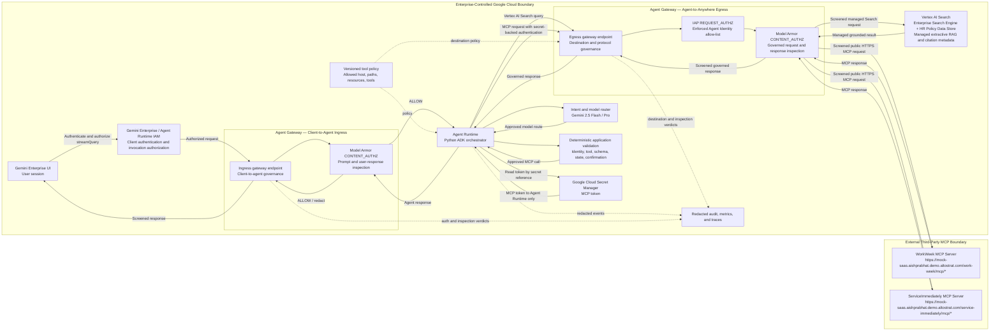
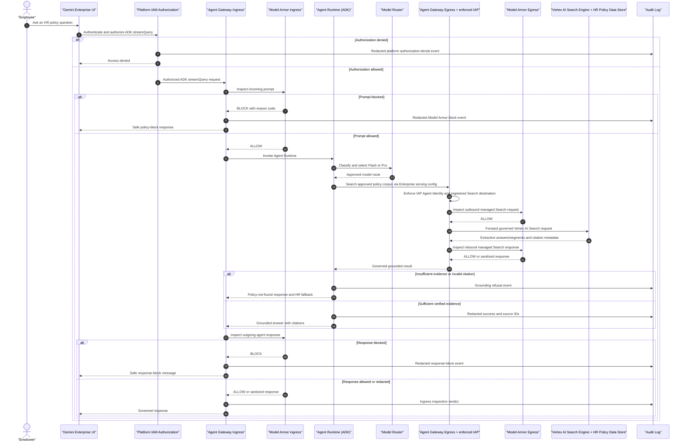
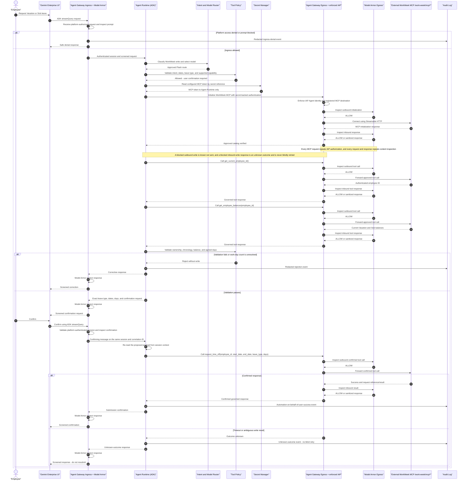
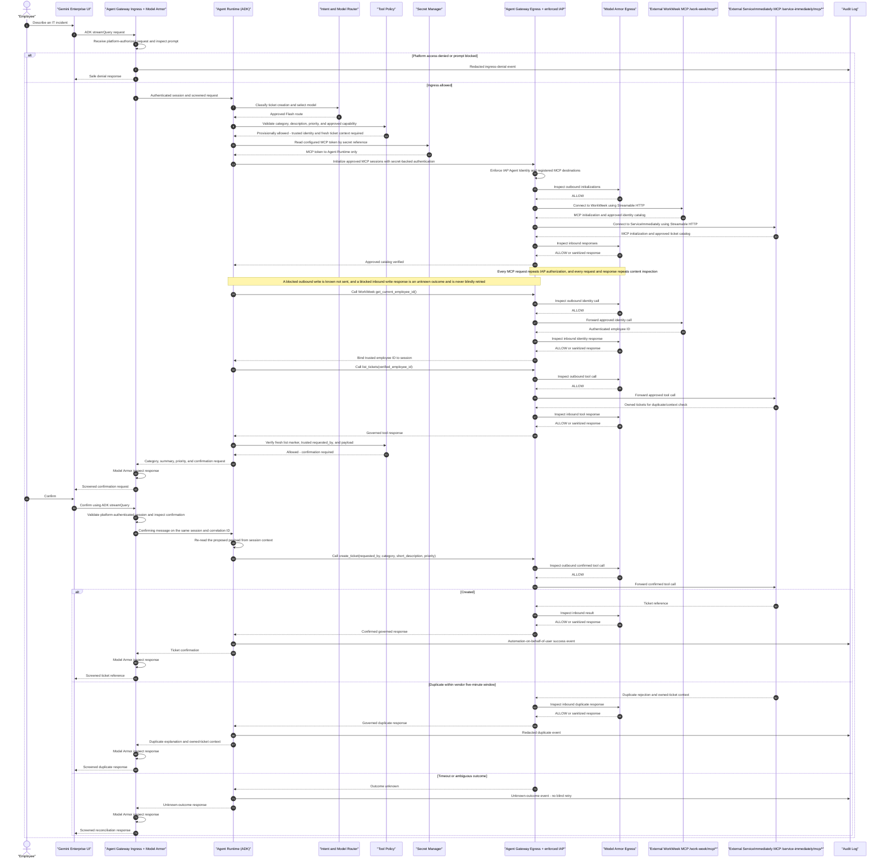

# SOLUTION DESIGN DOCUMENT

## Document Control

### Document Metadata

| Field | Value |
| :--- | :--- |
| **Document** | HR Agentic Solution — MVP 1 |
| **Author(s)** | Solution Architecture Team |
| **Version** | 2.0 |
| **Date** | 2026-07-21 |
| **Status** | Under Review |
| **Target Audience** | Engineering, Product, HR Operations, IT Service Management, Security, Privacy, Compliance, SRE, and the third-party MCP service owner |
| **Business Requirements** | [HR Agentic Solution BRD](
) |
| **Design Template** | [Enterprise Agentic Solution Design Document](<Enterprise Agentic Solution Design Document .pdf>) |
| **Third-Party Architecture** | [Mock SaaS Architecture](<project-specs/Mock SaaS Architecture.pdf>) |
| **Third-Party Contract** | [Mock SaaS MCP OpenAPI](<project-specs/Mock SaaS MCP openapi.json>) |
| **Implementation Guide** | [M3 Lab Guides](<project-specs/M3 Lab guides.pdf>) |
| **Approved Policy Source** | [Altostrat Singapore Employee Policy Handbook](<project-specs/ALTOSTRAT SINGAPORE EMPLOYEE POLICY HANDBOOK & CONDUCT GUIDELINES.pdf>) |
| **Google Cloud References** | [Model Armor with Agent Gateway](https://docs.cloud.google.com/model-armor/model-armor-agent-gateway-integration); [Route Agent Runtime through Agent Gateway](https://docs.cloud.google.com/gemini-enterprise-agent-platform/scale/runtime/agent-gateway-runtime-deploy); [Delegate authorization with Service Extensions](https://docs.cloud.google.com/gemini-enterprise-agent-platform/govern/gateways/delegate-authorization) |

### Revision History

| Version | Date | Author | Description of Change |
| :--- | :--- | :--- | :--- |
| 0.1 | 2026-07-20 | Discovery Team | Initial BRD analysis and requirement mapping. |
| 1.0 | 2026-07-20 | Solution Architecture Team | Initial end-to-end solution design. |
| 1.1 | 2026-07-20 | Lead Solution Architect | Added Google Cloud agent-platform and governance components. |
| 1.2 | 2026-07-20 | Solution Architecture Team | Corrected the MCP trust boundary to third-party hosting; aligned endpoint paths, authentication, resources, tools, guardrails, failure handling, UAT, and open questions with the supplied BRD and vendor specification. |
| 1.3 | 2026-07-20 | Solution Architecture Team | Clarified that WorkWeek and ServiceImmediately are opaque external MCP services, Agent Runtime queries a fully managed Vertex AI Search Data Store directly for RAG, and Agent Runtime retrieves the MCP token from Secret Manager for external MCP connections. |
| 1.4 | 2026-07-20 | Solution Architecture Team | Completed final consistency review; corrected all sequence diagrams to route MCP traffic through governed egress with input/output safety checks; standardized Agent Runtime, Secret Manager, external MCP, and Vertex AI Search Data Store terminology; added linked BRD references to quality evaluation. |
| 1.5 | 2026-07-20 | Solution Architecture Team | Added explicit Client-to-Agent Agent Gateway ingress with IAP/IAM authorization and Model Armor prompt/response inspection; added Model Armor inspection to Agent-to-Anywhere MCP request/response paths; updated diagrams, security, deployment, operations, and UAT controls. |
| 1.6 | 2026-07-20 | Solution Architecture Team | Final implementation reconciliation: added the fully managed Vertex AI Search Enterprise Search Engine serving layer over the HR Policy Data Store for extractive evidence; recorded test deployment, end-to-end Agent Gateway and Model Armor validation, BRD-linked 12/12 evaluation evidence, and the external MCP PAT blocker. |
| 1.7 | 2026-07-21 | Solution Architecture Team | Installed the test PAT in Secret Manager; validated authenticated WorkWeek and ServiceImmediately reads, confirmation rejection and one confirmed mock write, deterministic identity and list-before-create controls, a bounded concurrency benchmark, credential-pattern scans, and a final no-change Terraform plan. Recorded the temporary dual-header vendor/gateway compatibility deviation and updated all affected sequences, UAT evidence, gaps, and production gates. |
| 1.8 | 2026-07-21 | Solution Architecture Team | Reconciled the final enforced architecture: Client-to-Agent ingress uses platform IAM plus Agent Gateway Model Armor because IAP Service Extensions are not supported on ingress; Agent-to-Anywhere egress uses enforced IAP and fail-closed Model Armor. Switched governed Secret Manager and Vertex AI Search calls to REST/HTTP JSON, proved 5/5 end-to-end journeys with 85 allowed and zero denied/dry-run IAP decisions, and recorded the approved token, dual-header, extra-tool, and bounded-load decisions. |
| 2.0 | 2026-07-22 | Solution Architecture Team | Redeployed to `project-elevate-503008` (org `654680440018`) and reconciled the document with that deployment. Added the Gemini Enterprise app front door with Cloud Identity, the registered ADK agent, and Gemini Enterprise User access for the demo cohort. **Withdrew the dual-header MCP deviation**: the vendor contract requires `X-MCP-Token` only because Google Frontend intercepts `Authorization`. Corrected the Model Armor authz-extension template path from `locations/global` to the region, which had made both gateways reject traffic with 404; both gateways are now bound and enforcing. Enabled Agent Runtime telemetry, moved the model to `gemini-3.5-flash`, and expanded the golden benchmark to 28 cases with weighted scoring and judge calibration. Recorded the Gemini Enterprise licence gate (OQ-14) and the intermittent empty-response defect (OQ-15). |
| 2.1 | 2026-07-23 | Solution Architecture Team | Reconciled the write-confirmation mechanism with the Gemini Enterprise chat surface. The ADK human-in-the-loop tool gate (`confirmation=True`) was removed: it emits an `adk_request_confirmation` that requires a structured `ToolConfirmation` approval the chat surface cannot send, so consequential writes could never commit (the user typing "confirm"/"approve" only re-triggered the gate). Writes now use **conversational confirmation** — the owning specialist presents the exact payload and executes the write only after the employee confirms in a following message. The deterministic identity, list-before-create, priority, and state-transition controls are unchanged and still enforced at the tool boundary. Also recorded that specialist routing uses transfer-based `sub_agents` with `disallow_transfer_to_parent/peers` (non-sticky); an AgentTool trial was rejected because wrapping a confirmation-gated agent as a tool produced an orchestrator auto-confirm loop. |

---

## 1. Executive Summary & Scope Boundaries

### 1.1. Business Overview & Context

Employees currently navigate separate HR policy repositories, WorkWeek HCM screens, and ServiceImmediately ITSM screens for routine questions and transactions. The resulting fragmented experience increases Tier 1 ticket volume and delays common activities such as checking leave balances, submitting time off, updating contact information, and managing incidents.

The HR Agentic Solution provides one conversational entry point for policy questions and authorized self-service actions. An ADK-based agent running in Agent Runtime grounds policy answers through a fully managed Vertex AI Search Enterprise Search Engine backed by the HR Policy Data Store and invokes two externally hosted Model Context Protocol (MCP) services for WorkWeek and ServiceImmediately. The Search Engine is the managed serving configuration; the Data Store remains the managed policy corpus and index. No separate RAG server, RAG MCP server, Cloud Run service, vector database, or other customer-managed RAG compute is deployed. The enterprise owns the user experience, agent, security controls, Vertex AI Search resources, outbound governance, audit records, and MCP token. The third party owns and operates both external MCP services; its internal hosting implementation is outside the solution boundary.

#### Key Concept Analogies (For Business Sponsors)
To demystify these advanced agentic AI concepts for business sponsors and stakeholders:
* **Retrieval-Augmented Generation (RAG) as an "Open-Book Exam":** Instead of relying on the AI model's general training memory (which can result in "hallucinations" or fabricated facts), RAG operates like a student taking an *open-book exam*. The AI is strictly required to locate the answer within the approved Altostrat Employee Handbook (our HR "textbook") and provide a citation to the source page or section. If the textbook does not contain the answer, the AI must refuse to answer.
* **Model Context Protocol (MCP) as a "Guided Escort":** The AI does not have direct, unmonitored access to backend databases or systems. Instead, it must communicate through MCP, which functions like a *guided escort*. The AI requests a secure, predefined agent (the MCP server) to perform specific actions on its behalf—such as reading leave balances or submitting tickets. The AI cannot execute raw code or access fields outside the strict boundary of the allowed tool catalog.

MVP 1 has the following measurable goals:

- Reduce routine Tier 1 HR and IT ticket volume by at least 40% within six months.
- Achieve at least 95% accuracy on the approved policy benchmark with no hallucinated policy facts.
- Execute supported transactions with 100% correctness and no unauthorized cross-user access.
- Begin generating responses within 10 seconds, with safety scanning adding no more than 300 ms per turn under the agreed test load.
- Log every allowed and denied action with an unambiguous automation origin, while excluding credentials and redacting sensitive personal information.

### 1.2. Scope Boundaries

#### In Scope for MVP 1

- English-language conversational access through the Gemini Enterprise UI, with isolated multi-turn sessions.
- Policy Q&A over approved HR documents stored and indexed in an HR Policy Data Store and served through its Vertex AI Search Enterprise Search Engine, including extractive evidence, grounding, refusal when evidence is insufficient, and clickable document/section citations.
- WorkWeek MCP capabilities supplied by the third party:
  - Resolve the employee associated with the authenticated MCP context.
  - Read employee profile and Vacation/Sick balances without caching employee data in the agent layer.
  - Update home address and phone number.
  - Submit Vacation or Sick time-off requests.
- ServiceImmediately MCP capabilities supplied by the third party:
  - List the authenticated employee's tickets and retrieve ticket detail resources.
  - Create tickets, add comments, and update status using the supported state machine.
- Cross-system orchestration only where all required policy data, profile fields, and MCP operations exist and pass authorization and UAT.
- Input/output safety screening, prompt-injection defenses, allow-listed tool execution, credential protection, PII redaction, RBAC, audit logging, monitoring, and graceful failure handling.
- Single-tenant MVP operation using controlled functional test identities and third-party personal access tokens (PATs). Enterprise SSO delegation to the third party is not included in MVP 1.

#### Out of Scope for MVP 1

- Hosting, configuring, deploying, scaling, patching, or directly observing the third-party WorkWeek and ServiceImmediately MCP infrastructure.
- Direct access to any third-party data store or hosting infrastructure behind the external MCP endpoints.
- Runtime use of the vendor REST endpoints unless separately approved through architecture, security, and contract change control. The runtime integration described in this document uses MCP.
- Payroll, compensation, performance review, voice, multilingual, and multi-tenant capabilities.
- Automatic cancellation or correction of a leave request because the supplied MCP toolset has no compensation tool.

#### Known BRD-to-Contract Gaps

The following are BRD requirements or use-case dependencies that the supplied MCP contract cannot currently satisfy. They are release blockers for the affected acceptance tests, not silently removed scope:

- The WorkWeek profile resource does not document the BRD-required `department` and `hire date` fields or the remote-work status needed by UC-2.1.
- The WorkWeek MCP toolset supports Vacation and Sick requests but not the Leave of Absence operation needed by UC-2.2.
- The WorkWeek MCP toolset has no corporate holiday/calendar operation for authoritative work-day calculation.
- The WorkWeek MCP toolset has no cancel/correct request tool for automated compensation.
- Vendor response schemas, idempotency behavior, rate limits, complete error codes, and production SLA are not supplied.

The live WorkWeek catalog also advertises `cancel_leave_request` and `get_personal_info`. Product has accepted their presence because MVP does not use them; both remain excluded from the runtime allow-list and therefore do not expand executable scope.

### 1.3. Target Architecture Overview

Client traffic is authenticated and authorized by Gemini Enterprise and Agent Runtime IAM, then enters Agent Gateway in **Client-to-Agent** mode. The gateway invokes an ingress Model Armor template to inspect the incoming prompt; responses return through the same gateway and are inspected before display. IAP request-authorization Service Extensions are not supported for Client-to-Agent gateways, so this design does not attach IAP to ingress. Inline ingress inspection applies to the ADK `reasoningEngines.streamQuery` request/response flow used by this design; unsupported Reasoning Engine methods are not exposed as alternate client paths.

External MCP and governed Google API traffic leaves through Agent Gateway in **Agent-to-Anywhere** mode. Enforced IAP request authorization default-denies unregistered destinations and permits the Agent Identity only to registered regional Agent Registry entries; the egress Model Armor template then inspects supported outbound requests and inbound responses. The allowed MCP URL prefixes are `https://mock-saas.aishprabhat.demo.altostrat.com/work-week/mcp/*` and `https://mock-saas.aishprabhat.demo.altostrat.com/service-immediately/mcp/*`. The vendor specification authenticates MCP traffic with `X-MCP-Token` only, because Google Frontend intercepts and validates a standard `Authorization` header and a vendor PAT is not a valid Google credential. The runtime therefore sends the Secret Manager PAT in `X-MCP-Token` alone. An earlier deviation that additionally sent the PAT as `Authorization: Bearer …` has been withdrawn as contrary to the vendor contract; it remains available behind `MCP_SEND_AUTHORIZATION_HEADER=true` for vendor-side diagnosis only. The header is added outside model-visible context and its value is suppressed from gateway, Model Armor, application, and telemetry logs. The external MCP servers do not retrieve secrets from enterprise Secret Manager.

Agent Gateway and its Model Armor templates are deployed in the same Google Cloud region because cross-region Model Armor callouts are not supported. Separate ingress and egress templates are used so client-interaction policy can be tuned independently from MCP data-loss and tool-content policy.

Policy retrieval remains inside the enterprise-controlled GCP boundary in Vertex AI Search. The approved document is stored and indexed in the HR Policy Data Store; an Enterprise Search Engine attached to that Data Store supplies the managed serving configuration, extractive answers/segments, and citation metadata. Agent Runtime invokes that managed Google API through Agent-to-Anywhere governance and the egress Model Armor template. Policy retrieval is not part of the third-party MCP contract and is not hosted as an MCP, Cloud Run workload, or customer-managed compute service.

#### Core Responsibilities

| Responsibility | Enterprise | Third Party |
| :--- | :---: | :---: |
| User/session authentication and agent authorization | Accountable | — |
| Client/Agent Runtime IAM, Client-to-Agent Agent Gateway, and ingress Model Armor policy | Accountable | — |
| Intent classification, model selection, confirmation, and orchestration | Accountable | — |
| Vertex AI Search Enterprise Search Engine and Data Store, policy ingestion, grounding, and citations | Accountable | — |
| MCP token storage in Secret Manager, runtime retrieval, header injection, and rotation coordination | Accountable | Supports token issuance/revocation |
| Agent-to-Anywhere Agent Gateway, outbound host/path allow-list, and egress Model Armor policy | Accountable | — |
| External WorkWeek and ServiceImmediately MCP hosting and availability | — | Accountable |
| Tool/resource ownership enforcement | Verifies before call | Enforces authoritatively |
| End-to-end audit correlation | Accountable | Supplies agreed correlation/error data |

### 1.4. Alternatives Considered

| Decision | Selected Option | Alternatives and Rationale |
| :--- | :--- | :--- |
| External integration protocol | MCP Streamable HTTP using the supplied resources and tools | Direct REST was rejected for the agent runtime because it bypasses MCP discovery and duplicates server guardrails. It remains an administrative surface only if separately approved. |
| MCP hosting | Third-party hosted public HTTPS service | Customer-hosted MCP compute was rejected because it contradicts the supplied ownership model. Private connectivity can be reconsidered only if the vendor offers a documented private endpoint. |
| Authentication | Vendor PAT stored by reference in Secret Manager and sent in `X-MCP-Token` only, per the vendor specification | OIDC/IAP and mTLS client-certificate authentication were rejected because the vendor MCP contract does not accept them. A standard `Authorization` header must not be used: Google Frontend intercepts and validates it, and a vendor PAT is not a valid Google credential. Hard-coded tokens and plaintext environment files remain prohibited. |
| Employee data caching | No employee profile or balance cache | A session cache could reduce latency but violates BRD FR-3.4 and risks stale authorization/business decisions. |
| Tool execution | Exact versioned allow-list plus runtime MCP discovery validation | Unbounded dynamic tool use was rejected because a newly exposed vendor tool must not become automatically callable without review. |
| Model routing | Gemini 2.5 Flash for routine classification/synthesis; Gemini 2.5 Pro for approved complex reasoning | A single Pro route increases latency/cost; a single Flash route may reduce performance on multi-document or multi-step reasoning. Transactions remain deterministic regardless of model. |
| Write recovery | Confirmation, no blind retry, reconciliation, and manual follow-up | Automatic rollback was rejected because the MCP contract has no cancel/correct-leave tool and blind retries can duplicate writes. |

---

## 2. Production-Ready Future State Design

### 2.1. Component and Technology Decisions

| Layer | Production Design | Key Configuration |
| :--- | :--- | :--- |
| Experience | Gemini Enterprise UI — app `hr-agent-ge-app_1784621470050`, agent `M3 HR Enterprise Agent` | Cloud Identity authentication, isolated sessions, explicit confirmation before consequential writes, accessible citations and status messages. The agent is selected from the Gemini Enterprise agent gallery; it must carry `sharingConfig.scope` to appear there, and agent selection is a UI action with no API equivalent in this version. |
| Ingress governance | Platform IAM plus Agent Gateway in Client-to-Agent mode with Model Armor | Permit only the ADK `reasoningEngines.streamQuery` flow; authenticate and authorize the client through supported platform IAM; inspect incoming prompts and outgoing agent responses; block before Agent Runtime or before display when content policy fails. IAP Service Extensions are not attached because Client-to-Agent mode does not support them. |
| Agent runtime | Agent Runtime on the Gemini Enterprise Agent Platform with Python ADK | Versioned agent package, bounded tools, structured state, deadlines, correlation IDs, OpenTelemetry instrumentation, and no credential values in state. |
| Model routing | Gemini 2.5 Flash and Gemini 2.5 Pro on Vertex AI | Flash handles intent, parameter extraction, simple policy synthesis, and confirmations. Pro is used only for complex multi-document or cross-system planning after safety checks. Model selection is logged without raw prompts. |
| Policy retrieval | Fully managed Vertex AI Search Enterprise Search Engine backed by the HR Policy Data Store | Source ACL ingestion, managed indexing and extractive retrieval, stable document IDs, active-link validation, evidence checks, citation metadata, and incremental synchronization. Runtime API calls use governed Agent-to-Anywhere egress and Model Armor inspection. The sync target remains an open business decision. No separate MCP-based, Cloud Run, or customer-managed RAG service is deployed. |
| Safety | Regional Model Armor ingress/egress templates plus deterministic application validation | Ingress template inspects client prompts and agent responses. Egress template inspects supported governed Google API and MCP requests/responses. Application policy validates identity, schemas, state transitions, and confirmations. DLP controls also protect state, logs, and traces. |
| Egress governance | Agent Gateway in Agent-to-Anywhere mode with enforced IAP, regional Agent Registry, and application tool policy | Default-deny unregistered destinations; grant the Agent Identity `roles/iap.egressor` only across the bounded registry; allow the vendor MCP prefixes and required Google APIs; invoke Model Armor before sending governed content and before delivering governed responses to Agent Runtime. Newly discovered capabilities remain blocked by default. |
| Secret management | Google Cloud Secret Manager | Store the approved MCP token as a versioned secret; grant Agent Runtime least-privilege access to that secret; retrieve it at connection time and add it as `X-MCP-Token` only; never expose it to the model, browser, logs, or traces. Version 1 is enabled and approved for this test deployment. |
| Asynchronous state | Durable enterprise-controlled workflow store | Store correlation ID, verified user reference, step state, timestamps, and redacted results only. Long-running work returns a tracking response and never retains PATs or unnecessary HR data. |
| Observability | Cloud Logging, Monitoring, Trace, and alerting | Record platform invocation authorization, Model Armor allow/block/redact verdicts, enforced egress IAP destination decisions, vendor duration/result, and correlation IDs without prompts, PII, token values, `X-MCP-Token`, or `Authorization`. Do not claim internal vendor spans unless supplied by the vendor. |

### 2.2. Model Routing and Deterministic Boundaries

The router first classifies the request as policy Q&A, WorkWeek read/write, ServiceImmediately read/write, supported cross-system intent, or unsupported/off-topic. Routine single-domain turns use Gemini 2.5 Flash. Gemini 2.5 Pro is permitted only when the request requires multi-document reasoning or an approved cross-system plan. The router falls back to Flash if the Pro route is unavailable and the request can be completed without reducing correctness; otherwise it reports temporary unavailability.

Models never decide authorization, employee identity, allowed state transitions, balance sufficiency, input formats, or whether a write succeeded. Those decisions are made by authenticated context, schemas, deterministic policy code, and authoritative MCP responses. A model proposes a tool call; the tool policy validates and either executes or rejects it.

### 2.3. Reliability, Scalability, and Service Levels

#### Horizontal Scaling & Concurrency Limits
- **Stateless Components Scaling**: Client-to-Agent Ingress Gateways, Agent Runtime (Vertex AI Agent Engine), Model Armor instances, and the Vertex AI Search engine are fully managed, stateless Google Cloud services. They are configured to scale horizontally across regional availability zones. 
- **Peak Capacity Target**: The architecture is sized to support a peak concurrent workload of **100 Transactions Per Second (TPS)** (supporting a user base of ~5,000 active concurrent employees during peak HR periods like open enrollment).
- **Model API Quotas**: Vertex AI Gemini 2.5 Flash/Pro quotas are provisioned at regional levels (targeting a minimum limit of 3,000 Requests Per Minute (RPM) and 2M Tokens Per Minute (TPM)) to avoid API rate-limiting during high traffic volumes.

#### Session State Store Scaling & Concurrency (Firestore)
- **Firestore Partitioning**: Conversation history and session metadata are stored in Cloud Firestore. Firestore handles horizontal partitioning automatically and natively supports up to 10,000 write operations per second per database.
- **Optimistic Concurrency Control**: To prevent write conflicts or race conditions (e.g., if a user repeatedly clicks the "Submit Leave" button), the Agent Runtime enforces session-level optimistic concurrency using Firestore transaction tokens (document versioning) and locks out concurrent execution for the same session ID.

#### Database Connection Pooling & Backend Protection (Cloud Run MCP)
- **Container Concurrency Limits**: The custom Cloud Run-hosted MCP adapter services (if hosted internally, or proxy configurations) enforce a maximum container concurrency setting of **80 concurrent requests per container instance**, with auto-scaling configured up to 50 container instances. This limits the maximum concurrency footprint to 4,000 active database tasks.
- **Connection Pooling**: To prevent downstream database connection exhaustion in the WorkWeek and ServiceImmediately systems during peak traffic:
  - Adapter containers run dynamic connection pools (using standard frameworks like SQLAlchemy/HikariCP) configured with a strict **maximum pool size of 20 connections** and a minimum of 2 idle connections per container.
  - Idle connections are closed after 10 minutes of inactivity.
- **Circuit Breakers**: A circuit-breaker policy is active at the Agent Gateway egress layer. If backend connection latency to WorkWeek or ServiceImmediately exceeds **3.0 seconds** over 10 consecutive requests, the circuit breaker trips for 30 seconds, immediately returning a cached "Temporary Integration Timeout" response to subsequent requests to protect the downstream systems from cascading failures.

#### Service Levels & Fault Tolerance
- Every vendor call has a connection timeout, response deadline, total turn budget, and circuit breaker. Final values are established during performance testing and must keep time-to-first-response within the BRD threshold.
- Read-only calls may be retried for transient failures with bounded exponential backoff and jitter. Consequential writes are not blindly retried after an ambiguous result.
- The enterprise monitors Client-to-Agent authorization, ingress Model Armor verdicts, synthetic MCP initialization, egress Model Armor verdicts, resource reads, non-destructive test-tenant tool calls, vendor latency, schema drift, and circuit-breaker state.
- Agent Runtime, both Agent Gateway modes, and their Model Armor templates are regionally aligned. Protected traffic fails closed if the required authorization or Model Armor callout cannot complete.
- The BRD 99.9% end-to-end availability target includes the third-party dependency. It cannot be committed until the vendor supplies an availability objective, maintenance policy, support escalation, and recovery terms that permit the composite target.
- The enterprise cannot configure or directly observe the third party's hosting platform, scaling, data store, or edge capacity. These are external service-level dependencies.

### 2.4. Data Lifecycle

- Employee profile and leave balance data is fetched from WorkWeek for every query and is not cached in the orchestration layer.
- Conversation state stores only the minimum redacted information needed for the current session and is isolated by authenticated session and tenant.
- Raw MCP payloads containing personal data are not written to general-purpose logs. Audit events record field names, decision outcomes, hashed/pseudonymous subject references, timestamps, tool names, and correlation IDs.
- Retention, residency, deletion, legal basis, and data-processing agreement requirements remain subject to Privacy and Legal approval in Section 10.

---

## 3. System Flows, Sequence Diagrams & Agent Design

### 3.1. Request Pre-Processing and Tool Boundary

Every turn follows this order:

1. The Gemini Enterprise UI authenticates the employee and platform IAM authorizes the ADK `reasoningEngines.streamQuery` invocation.
2. The authorized request enters Agent Gateway in Client-to-Agent mode and establishes a correlation ID. IAP is not attached to this path because Client-to-Agent gateways do not support IAP Service Extensions.
3. The ingress gateway invokes the regional Model Armor ingress template to inspect the prompt for injection, jailbreaks, unsafe content, malicious URLs, and sensitive data policy. A blocking verdict ends the flow before Agent Runtime.
4. Agent Runtime classifies intent and selects Flash or Pro under the routing policy.
5. Agent Runtime resolves user identity from trusted session/token mapping; an employee ID in prompt text is never accepted as proof of identity.
6. Agent Runtime queries the Enterprise Search Engine serving configuration backed by the Vertex AI Search Data Store or proposes an approved MCP resource/tool call.
7. Deterministic policy validates the host, path, capability, arguments, ownership, state transition, and confirmation requirement.
8. Agent Runtime retrieves the PAT by Secret Manager reference and adds the approved dual vendor headers outside model-visible context.
9. Agent Gateway in Agent-to-Anywhere mode enforces IAP authorization against the regional Agent Registry, invokes the regional Model Armor egress template on the outbound governed request, forwards only an allowed request, and invokes Model Armor again on the inbound response.
10. Agent Runtime records a redacted result and sends the final response through the Client-to-Agent gateway, where Model Armor inspects it before display.
11. The UI receives grounded information, a confirmed transaction reference, or a clear non-technical failure message. Gateway and Model Armor logs never persist the MCP token or raw sensitive values.

The approved third-party MCP catalog is:

| Server | MCP Resources | MCP Tools |
| :--- | :--- | :--- |
| WorkWeek `/work-week/mcp/*` | `workweek://employees/{employee_id}/profile`; `workweek://employees/{employee_id}/timeoff` | `get_current_employee_id()`; `get_employee_balances(employee_id)`; `request_time_off(employee_id, start_date, end_date, leave_type, days)`; `update_personal_info(employee_id, address, phone)` |
| ServiceImmediately `/service-immediately/mcp/*` | `serviceimmediately://tickets/{ticket_id}` | `list_tickets(employee_id)`; `create_ticket(requested_by, category, short_description, priority, assignment_group='Service Desk')`; `add_ticket_comment(ticket_id, author, comment)`; `update_ticket_status(ticket_id, status, resolution_notes='', updated_by='System')` |

MCP initialization and `list_tools`/resource discovery are used to compare the live server with this approved catalog. Discovery does not grant authorization: unknown, renamed, or schema-changed capabilities are blocked and raise a contract-drift alert. The 2026-07-21 test found two additional WorkWeek tools, `cancel_leave_request` and `get_personal_info`; both remain excluded from the deployed tool filters.

### 3.2. Journey 1 — HR Policy Q&A

### 3.3. Journey 2 — WorkWeek Leave Request

The supplied MCP server has no holiday-calendar tool. Until the business defines the work-day calculation source, the agent must not infer holidays. It may proceed only when the `days` value is deterministically calculated from an approved calendar or explicitly confirmed under an approved MVP test rule.

### 3.4. Journey 3 — ServiceImmediately Ticket Creation

### 3.5. Cross-System Orchestration

Cross-system requests use a saga-style state record rather than a distributed transaction. Each step records `not_started`, `confirmed`, `failed`, or `unknown`. A subsequent step executes only after the previous write is confirmed. When no compensation tool exists, the agent stops, reports the completed step, provides manual follow-up, and alerts operations if required. It must never claim atomic rollback.

| Use Case | MVP Executability | Design Treatment |
| :--- | :--- | :--- |
| UC-2.1 Equipment Procurement | Blocked by missing remote-work status field | Policy explanation may run, but the agent must not verify remote eligibility or create the order until the vendor supplies an authoritative field/tool or the business approves another source. |
| UC-2.2 Medical Leave | Blocked by missing Leave of Absence tool | Policy explanation may run. Vacation/Sick tools must not be misrepresented as Leave of Absence. |
| UC-2.3 Relocation | Conditionally supported | Policy lookup, address/phone update, and facilities ticket creation can run if the business confirms category values, required profile data, and sequencing. No automatic rollback is available. |

---

## 4. Security, Governance & Identity

### 4.1. Identity and Authorization Boundaries

MVP 1 excludes enterprise SSO integration with the downstream MCP systems. Enterprise UI authentication and Agent Runtime IAM authorize the conversational invocation before the request reaches the Client-to-Agent gateway. The gateway applies Model Armor content authorization; it does not attach IAP because IAP Service Extensions are not supported for Client-to-Agent mode. The external MCP service separately uses a vendor PAT. A controlled mapping between the authorized enterprise test user, vendor PAT secret reference, and expected employee ID is therefore a release prerequisite. A shared PAT that can represent multiple employees does not meet FR-1.5 unless the vendor supplies an independently verifiable delegated identity mechanism.

For every employee-specific WorkWeek or ServiceImmediately journey, the agent first calls WorkWeek `get_current_employee_id()` and binds the authenticated result to managed session state. For ServiceImmediately, the `requested_by`/`employee_id` argument is populated from that trusted result, never copied from free-form user text. The parser accepts the vendor's observed `structuredContent.result` identity shape only inside this authenticated identity callback. Vendor-side ownership checks remain authoritative and access-denied results are logged as security events.

| Actor | Permitted Actions | Prohibited Actions |
| :--- | :--- | :--- |
| Employee | Own profile/balance reads, own contact update, own Vacation/Sick request, own ticket operations allowed by state | Another employee's identifiers or resources; token administration; unapproved tools |
| Agent runtime | Invoke the approved catalog on behalf of a verified employee; retrieve only the mapped PAT | Display or log PATs; choose a different employee; invoke vendor admin/token APIs; bypass confirmation |
| Operations | View redacted service health and audit metadata; rotate secret references under dual control | View conversational content or personal data without approved support purpose |
| Security auditor | Review allowed/denied events and policy versions | Invoke employee transactions or retrieve PAT values |

### 4.2. Defense in Depth

1. **Platform client authorization:** Gemini Enterprise and Agent Runtime IAM authenticate and authorize the approved ADK `reasoningEngines.streamQuery` invocation and record allowed and denied decisions without raw prompt content.
2. **Client-to-Agent ingress gateway:** expose only the approved ADK `reasoningEngines.streamQuery` flow, enforce rate limits and session isolation, and prevent alternate client paths to Agent Runtime.
3. **Ingress Model Armor:** inspect incoming prompts and outgoing agent responses; reject prompt injection, jailbreaks, unsafe/off-topic content, malicious URLs, and prohibited sensitive-data disclosure. A blocking verdict prevents runtime invocation or user display.
4. **Agent policy:** permit only approved intents, resources, tools, argument schemas, identity bindings, state transitions, and confirmed writes. Treat MCP content as untrusted data, not instructions.
5. **Agent-to-Anywhere egress gateway and IAP:** enforce Agent Identity authorization against the bounded regional Agent Registry; allow only required Google API endpoints and `https://mock-saas.aishprabhat.demo.altostrat.com:443` with the two exact MCP path prefixes. Block vendor REST/admin/token paths and all unregistered destinations.
6. **Egress Model Armor:** inspect supported outbound governed Google API/MCP requests and inbound responses. A blocked request is never sent to its destination; a blocked response never reaches Agent Runtime.
7. **Vendor authentication and isolation:** Agent Runtime injects the approved secret-backed `X-MCP-Token` header after model processing; vendor validation and tenant isolation remain authoritative; missing, expired, revoked, or mismatched tokens fail closed.
8. **Output and audit controls:** redact sensitive data from telemetry and record ingress/egress authorization, Model Armor, tool-policy, and transaction decisions with actor type `automation_on_behalf_of_user`.

Ingress Model Armor protection is deliberately limited to the ADK `reasoningEngines.streamQuery` request and response path supported for agents on Agent Runtime. Other Reasoning Engine methods are not exposed through the client integration. Model Armor and both gateway modes use templates in the same region as Agent Runtime. Application validation remains necessary because content inspection does not replace employee authorization, schema validation, state-machine enforcement, balance checks, or user confirmation.

### 4.3. Secret Management

- PATs are created/revoked through an approved vendor administrative process, not by the conversational agent.
- Secret Manager contains the MCP token value; Agent Runtime configuration contains only the secret resource reference.
- The Agent Runtime service identity receives `secretAccessor` only for the environment-specific MCP token secret it requires. Human read access is break-glass, approved, and audited.
- Token values and authentication headers, including `X-MCP-Token` and `Authorization`, are suppressed from Agent Runtime, Agent Gateway, Model Armor, HTTP debug, exception, trace, analytics, and support-bundle logs. Model Armor content templates inspect MCP payloads without persisting authentication secrets.
- Rotation uses overlapping secret versions only if the vendor supports them. A synthetic initialization test validates the new version before the old token is revoked.
- Authentication failures trigger bounded alerts and never cause fallback to another user's PAT.

### 4.4. Sensitive Data and Audit Design

The sensitive-data inventory includes employee ID, name, email, department, role, manager, hire date, home address, phone number, leave balances/requests, ticket descriptions/comments, and any medical information entered by the user. Controls apply to input, model context, MCP arguments/results, conversation history, workflow state, logs, traces, and exported evaluation data—not only SSNs or final responses.

Audit events include timestamp, correlation ID, pseudonymous user reference, automation identity, session reference, platform invocation authorization result, ingress/egress Model Armor verdict, egress IAP decision, model route, policy/tool version, MCP destination and capability, confirmation evidence hash, result category, latency, and redacted error code. Audit events exclude PATs, authentication headers, raw prompts, raw personal fields, and unnecessary MCP payloads. DLP inspection and deterministic field suppression run before long-term storage. Retention and access are governed by the unresolved Privacy decisions in Section 10.

---

## 5. Integration Details & Error Handling

### 5.1. Third-Party MCP Connection

| Property | WorkWeek | ServiceImmediately |
| :--- | :--- | :--- |
| Allowed URL prefix | `https://mock-saas.aishprabhat.demo.altostrat.com/work-week/mcp/*` | `https://mock-saas.aishprabhat.demo.altostrat.com/service-immediately/mcp/*` |
| Transport | Stateless MCP Streamable HTTP over TLS | Stateless MCP Streamable HTTP over TLS |
| Authentication | Agent Runtime reads the approved MCP PAT from Secret Manager and intentionally sends it as both `X-MCP-Token` and Bearer authorization on the managed gateway path. | Agent Runtime reads the approved MCP PAT from Secret Manager and intentionally sends it as both `X-MCP-Token` and Bearer authorization on the managed gateway path. |
| Governed egress | Agent Runtime → Agent-to-Anywhere Agent Gateway → Model Armor request inspection → external MCP; response returns through Model Armor and the gateway | Agent Runtime → Agent-to-Anywhere Agent Gateway → Model Armor request inspection → external MCP; response returns through Model Armor and the gateway |
| Enterprise network policy | Exact host, port 443, exact path prefix | Exact host, port 443, exact path prefix |
| Hosting boundary | External third-party managed service; implementation is opaque to the enterprise solution | External third-party managed service; implementation is opaque to the enterprise solution |
| Runtime contract | Approved resources/tools in Section 3.1 | Approved resources/tools in Section 3.1 |

The REST routes documented in the OpenAPI file are not interchangeable with the MCP endpoints. In particular, REST identity headers, `/api/mcp-tokens`, and vendor administrative pages are not available to the agent. Every MCP initialization, resource request, tool call, and response traverses Agent-to-Anywhere Agent Gateway, enforced IAP, and the egress Model Armor template. Both direct and managed tests authenticate with `X-MCP-Token` only, as the vendor specification requires. The contract still lacks formal MCP JSON schemas, complete response schemas, rate limits, and a comprehensive error model; these are tracked as external dependencies.

### 5.2. WorkWeek Guardrails

- Call `get_current_employee_id()` and verify the result before any employee-specific operation.
- Fetch profile and balances directly for every query. Do not cache employee-specific dynamic data.
- Use `workweek://employees/{employee_id}/timeoff` when accrued and used values are required; use `get_employee_balances(employee_id)` for the vendor-calculated remaining balances used by the submission guardrail.
- Accept only `Vacation` or `Sick` values agreed with the vendor contract.
- Require `YYYY-MM-DD` dates; reject past start dates and `start_date > end_date`.
- Fetch current balances immediately before confirmation/write and reject `days` above the remaining balance.
- Accept address values of at least five characters and phone values matching the vendor rule `^\+?[\d\s\-()]{7,20}$`. Do not validate or update email because the supplied MCP update tool accepts only address and phone.
- Do not claim corporate holiday/weekend calculation by WorkWeek; no such MCP capability is supplied.

### 5.3. ServiceImmediately Guardrails

- Derive `requested_by`, `employee_id`, and comment author context from trusted identity mapping. Never accept ownership from prompt text.
- Priorities use the exact values expected by the vendor, including `1 - Critical`, `2 - High`, `3 - Moderate`, and `4 - Low`.
- `1 - Critical` requires an active outage, crash, or system-downtime description according to the vendor rule.
- The vendor rejects duplicate ticket submissions within five minutes. The agent must first bind WorkWeek `get_current_employee_id()` to the session and successfully list that employee's owned tickets. A deterministic fresh-list marker blocks `create_ticket` if this sequence was skipped and is consumed after every terminal create result, so a later create must list again. The vendor duplicate result remains authoritative.
- To satisfy the stricter BRD example while remaining within the vendor state machine, MVP permits: `New -> In Progress`, `In Progress -> Resolved/Closed`, and `Resolved -> In Progress/Closed`. The agent blocks direct `New -> Closed`, even though the vendor currently permits it. `Assigned` is not sent because it is absent from the vendor contract.
- Closed tickets are immutable. Resolution notes are required by enterprise policy before the agent requests `Resolved` or `Closed`, even though the vendor parameter is optional.

### 5.4. Error Taxonomy and User Fallbacks

| Failure | System Behavior | User Response | Retry/Reconciliation |
| :--- | :--- | :--- | :--- |
| Platform IAM denial | Reject the Agent Runtime invocation before Client-to-Agent content processing | Access is denied without revealing policy internals | No retry unless identity/authorization changes |
| Egress IAP denial | Reject an unregistered destination or unauthorized Agent Identity at Agent-to-Anywhere gateway | The requested integration is unavailable | No retry unless registry/IAM policy changes |
| Model Armor request block | Terminate at the applicable ingress or egress gateway and record a redacted verdict | Safe policy-block message | No automatic retry of unchanged content |
| Model Armor response block/redaction | Prevent unscreened content from reaching the UI or Agent Runtime. Treat a blocked inbound response to a dispatched write as `unknown`; retain a previously confirmed transaction if only its later user-facing response is blocked. | Safe blocked-response or unknown-outcome message; never imply the write failed | No blind write retry; reconcile through an authorized read/manual path |
| Agent Gateway or Model Armor callout unavailable | Fail closed for the protected path; alert SRE | Service is temporarily unavailable | Bounded infrastructure retry only within the turn deadline |
| Input/schema/business-rule validation | Reject before network call; log reason code | Explain the field or rule that must change | No retry until input changes |
| PAT missing/expired/revoked | Fail closed; alert credential owner | Service authentication is temporarily unavailable | No token fallback; rotate/revalidate through runbook |
| Ownership/access denied | Stop workflow; security event | The requested record is not available to this identity | No retry; investigate mapping if unexpected |
| MCP initialization or catalog drift | Open circuit for affected server; alert engineering/vendor | Integration is temporarily unavailable | Retry only after approved contract validation |
| Read timeout, 429, or transient 5xx | Bounded backoff with jitter within turn deadline | Retry in progress, then temporary-unavailable message | Up to three read attempts; honor vendor retry guidance when supplied |
| Write rejected before execution | Preserve validation response | Explain safe corrective action | New confirmed request after correction |
| Write timeout/connection loss after dispatch | Mark outcome `unknown`; do not report success | Outcome is unconfirmed; do not resubmit | No blind retry; query owned state/history where supported, then manual support |
| Cross-system later step fails | Preserve confirmed earlier step; stop saga | State exactly what completed and what requires follow-up | Use supported compensation only; otherwise manual follow-up and operations alert |
| Policy retrieval unavailable/insufficient | Do not generate policy facts | Policy information cannot be verified; provide HR support path | Read retry within deadline; never use model memory as policy source |

The supplied MCP toolset cannot cancel/correct a leave request. Although a REST delete route appears in the OpenAPI document, the agent does not use it because the selected runtime boundary is MCP. A future compensation capability requires a documented MCP tool, authorization semantics, idempotency behavior, and separate approval.

### 5.5. Contract and Change Management

- Pin the tested MCP/SDK version and store a reviewed snapshot of discovered resources, tools, and schemas with the agent release.
- Run contract tests against the vendor test environment in CI and before production promotion.
- Block production deployment on removed/renamed capabilities, incompatible argument schemas, authentication changes, or ownership-test failure.
- Newly discovered tools are denied until threat modeling, privacy review, tool-policy update, and UAT are complete.
- Establish a vendor notification window, versioning policy, deprecation period, incident contact, status channel, and support escalation before production approval.

---

## 6. Cost Estimation & FinOps

### 6.1. Enterprise Cost Drivers

| Component | Cost Driver | Unit/Measurement | Control |
| :--- | :--- | :--- | :--- |
| Gemini inference | Input/output tokens by Flash and Pro | Tokens and calls by route | Default eligible traffic to Flash; cap context; retrieve only relevant evidence; monitor Pro-route rate. |
| Agent runtime | Sessions, runtime duration, and state operations | Requests, compute time, state reads/writes | Bound turn deadlines and workflow retention; autoscale; remove abandoned sessions. |
| Agent Gateway | Client-to-Agent and Agent-to-Anywhere governed traffic | Requests, processed bytes, and gateway operations | Allow only the ADK ingress protocol and exact MCP destinations; monitor bypass attempts and avoid duplicate gateway hops. |
| Vertex AI Search Engine and Data Store | Managed policy ingestion/indexing, extractive queries, and synchronization | Documents, indexed content, Enterprise Search queries, and LLM search add-on usage | Incremental sync, duplicate detection, source governance, citation validation, bounded extractive context, and stale-version cleanup. |
| Model Armor and DLP | Ingress prompt/response, egress MCP request/response, and telemetry inspection | Characters/bytes inspected and callout volume | Use separate tuned ingress/egress templates, deterministic field suppression before persistence, and latency/cost monitoring without bypassing required controls. |
| Egress and observability | External HTTPS traffic and telemetry volume | Bytes, log entries, metrics, trace spans | Redacted structured events, sampling for non-audit traces, retention tiers, payload-size limits. |
| Secret Manager | Secret versions and accesses | Stored versions/access operations | Cache only secret material in protected process memory for the minimum supported lifetime; never cache employee business data. |
| Third-party service | Vendor subscription/usage and support tier | Not supplied | Obtain pricing, included volume, overage, sandbox, support, and egress terms before business case approval. |

### 6.2. FinOps Controls

- Tag costs by environment, agent version, model route, and business journey without tagging personal identifiers.
- Set budgets and alerts for inference, Vertex AI Search Data Store usage, safety, logging, and third-party consumption.
- Report cost per successful policy answer, WorkWeek transaction, ticket transaction, and deflected Tier 1 contact.
- Load-test with representative prompt and MCP payload sizes before committing capacity or per-user business cases.
- Do not include any third-party MCP hosting components as enterprise infrastructure costs; they are part of the external commercial service.

---

## 7. Deployment & Delivery Plan

### 7.1. Environments and Configuration

Use separate development, test/UAT, staging, and production projects or equivalent isolated environments. Each environment has distinct Client-to-Agent and Agent-to-Anywhere gateways, regional Model Armor templates, agent configuration, Vertex AI Search Engine and Data Store, logging sink, service identities, MCP token secret reference, and vendor tenant/test data. Production MCP tokens and personal data are prohibited in non-production environments.

Enterprise-owned infrastructure and policy are managed through reviewed IaC. This includes both Agent Gateway modes, enforced egress IAP authorization, platform IAM bindings, Model Armor template references, required gateway/runtime service-account permissions, exact MCP URL-prefix policies, and redacted logging configuration. Agent Runtime, gateways, and Model Armor templates must use the same approved region. The external MCP servers and all infrastructure behind their public endpoints remain outside enterprise Terraform state.

### 7.2. Delivery Milestones

1. **Foundation and security boundary**
   - Provision enterprise projects, Agent Runtime identity, the Secret Manager MCP-token secret/reference, redacted audit sinks, budgets, and alerts.
   - Configure platform IAM and Client-to-Agent Agent Gateway with an ingress Model Armor template for ADK prompt/response screening; do not attach unsupported ingress IAP Service Extensions.
   - Configure Agent-to-Anywhere Agent Gateway with enforced IAP, the regional Agent Registry allow-list, and an egress Model Armor template for governed request/response screening.
   - Grant only the required Model Armor callout/user and service-usage permissions to the appropriate Agent Runtime and gateway service agents; validate regional alignment and token-header suppression.
   - Agree the test-user/PAT/employee mapping and verify vendor ownership isolation.
2. **Policy retrieval**
   - Create/configure the HR Policy Data Store and attached Enterprise Search Engine in Vertex AI Search, connect the approved repository, ingest documents, preserve stable source/section metadata, and validate extractive evidence, active citations, and grounding refusal.
3. **MCP contract integration**
   - Implement both Streamable HTTP connections with the Secret Manager-backed `X-MCP-Token` header and retain direct `X-MCP-Token` contract tests.
   - Verify exact resources, tools, argument schemas, five-minute duplicate handling, priorities, state transitions, and contract drift behavior.
4. **Single-domain journeys**
   - Deliver policy Q&A, WorkWeek supported reads/writes, and ServiceImmediately supported reads/writes with confirmation and unknown-outcome handling.
5. **Cross-system journeys**
   - Deliver only the portions whose data and capabilities exist. Resolve the UC-2.1 and UC-2.2 blockers before claiming complete BRD coverage.
6. **Security, resilience, performance, and UAT**
   - Run platform IAM, enforced egress IAP, ingress/egress Model Armor allow/block/redact, gateway bypass, prompt-injection, PII, contract, failure-injection, and business acceptance suites from Section 9. The bounded load smoke is accepted for the MVP test cycle.
7. **Production readiness and release**
   - Obtain Product, HR, ITSM, Security, Privacy, SRE, and vendor sign-off; complete runbooks and on-call paths; publish the populated design artifact; promote the immutable release.

### 7.3. Release and Rollback

Use progressive exposure to controlled users and health-based rollback of enterprise agent/configuration releases. Rollback restores the previous agent, prompt, tool policy, and approved Vertex AI Search Engine/Data Store serving configuration. It does not undo already confirmed third-party transactions. During rollback, consequential tools can be disabled independently while policy Q&A remains available if safe.

Release evidence includes source revision, dependency lock, IaC plan, both gateway configurations, platform IAM and enforced egress IAP policy, ingress/egress Model Armor template IDs and versions, regional/IAM validation, tool-catalog snapshot, model/prompt versions, Data Store serving configuration, UAT report, security approvals, vendor contract-test result, and rollback rehearsal result.

---

## 8. Assumptions, Constraints, Risk & Mitigations

### 8.1. Assumptions

- HR supplies approved, current, access-controlled source documents and owners for citation validation.
- The third party supplies stable test and production tenants, PAT issuance/revocation, ownership isolation, and supported MCP endpoints matching the reviewed contract.
- Functional test identities can be mapped unambiguously to vendor employee identities for MVP 1.
- Enterprise security services can inspect the relevant application content within the BRD latency budget.
- All client interactions use the supported ADK `reasoningEngines.streamQuery` request/response path through Client-to-Agent Agent Gateway.
- Business owners will resolve the open capability and policy questions in Section 10 before affected use cases enter UAT.

### 8.2. Constraints

- WorkWeek and ServiceImmediately MCP services are externally hosted and reachable over public HTTPS; the enterprise does not control or depend on their internal hosting implementation.
- The external vendor MCP service accepts PAT authentication, not enterprise OIDC/IAP at the MCP endpoint. The managed path intentionally sends the approved PAT in both `X-MCP-Token` and Bearer authorization.
- Client-to-Agent and Agent-to-Anywhere gateways, Agent Runtime, and Model Armor templates must be regionally aligned; cross-region Model Armor callouts are not supported.
- MVP 1 is single tenant and excludes delegated downstream enterprise SSO.
- Employee profile and balance data cannot be cached in the AI orchestration layer.
- Only documented MCP resources/tools may be used. Missing Leave of Absence, remote-status, holiday-calendar, and leave-compensation capabilities constrain BRD use cases.
- The policy synchronization requirement remains unspecified in the BRD and must not be represented as a four-hour commitment without approval.

### 8.3. Risk Register

| ID | Risk | Impact / Likelihood | Mitigation | Owner |
| :--- | :--- | :--- | :--- | :--- |
| R-01 | PAT theft or accidental logging | Critical / Medium | Secret Manager, exact access, header redaction, disabled HTTP debug bodies, rotation/revocation tests, break-glass controls. | Security |
| R-02 | Employee-ID substitution or shared-token ambiguity | Critical / Medium | Trusted identity mapping, `get_current_employee_id`, vendor ownership enforcement, negative cross-user tests, fail closed. | Identity Lead / Vendor |
| R-03 | Duplicate write after timeout/retry | High / Medium | No blind write retry, confirmation payload hash, unknown-outcome state, reconciliation, vendor idempotency request. | Engineering / Vendor |
| R-04 | Vendor outage or latency prevents 99.9%/10-second targets | High / Medium | Deadlines, read retries, circuit breaker, synthetic monitoring, graceful degradation, vendor SLA/support terms. | SRE / Vendor Manager |
| R-05 | Vendor contract or discovered tools change without notice | High / Medium | Versioned allow-list, CI contract tests, default deny, deprecation/change-notice agreement. | Integration Lead / Vendor |
| R-06 | PII leaks through prompts, traces, state, tickets, or evaluation data | Critical / Medium | Data inventory, minimization, DLP and deterministic suppression before persistence, restricted access/retention, privacy tests. | Privacy / Security |
| R-07 | Model invents policy or transaction success | Critical / Low after controls | Strict evidence threshold, citation validation, authoritative tool result, never infer success from timeout, golden tests. | AI Lead |
| R-08 | Cross-system saga leaves a partial state | High / Medium | Confirm each step, stop on failed/unknown result, precise user disclosure, supported compensation only, manual follow-up. | Product / Operations |
| R-09 | BRD use cases depend on absent data/tools | High / High | Track UC-2.1 and UC-2.2 as blockers; obtain vendor enhancement or approve scope change before UAT. | Product / Vendor |
| R-11 | Policy source changes produce stale or broken citations | High / Medium | Data Store sync monitoring, active-link checks, immutable source IDs, rollback to the prior approved serving configuration, and owner alerts. | Knowledge Owner |
| R-12 | External service processes data outside approved jurisdiction/retention | Critical / Unknown | DPA, residency/retention review, data minimization, production hold until Legal and Privacy approve. | Legal / Privacy |
| R-13 | Gateway or Model Armor misconfiguration allows bypass, leaks a token header, or blocks legitimate traffic | Critical / Medium | IaC-only configuration, no direct runtime endpoint, exact protocol/destination policies, separate templates, regional/IAM validation, fail-closed behavior, header-redaction tests, and continuous synthetic checks. | Security / Platform / SRE |

---

## 9. Quality Evaluation & UAT Framework

### 9.1. Acceptance Metrics

| Category | BRD Reference | BRD Target | Verification and Pass Rule |
| :--- | :--- | :--- | :--- |
| Policy Q&A accuracy | [NFR-3.1, p.15](
) [Success Criteria, p.17](
) | At least 95%; no hallucinated policy facts | Versioned golden set reviewed by HR. At least 95% correct answers and zero assertions unsupported by cited approved sources. |
| Deflection | [Project Objective — Deflect Tier 1 Inquiries, p.1](
) | At least 40% within six months | Compare normalized eligible Tier 1 volume before/after release; exclude outages and unsupported use cases; report confidence and adoption. |
| Transaction integrity | [Success Criteria — Transaction Integrity, p.17](
) | 100% correctness and no unauthorized updates | Reconcile every UAT write with vendor records; zero duplicates, corrupt records, wrong-user operations, or false success messages. |
| Cross-system orchestration | [UC-2.1–UC-2.3, pp.5–6](
) [Success Criteria, p.17](
) | Pass all approved UC-2.x journeys | UC-2.1/UC-2.2 cannot pass until their missing capabilities are resolved. Partial demonstrations are not recorded as passes. |
| Safety efficacy | [FR-1.3, p.7](
) [Success Criteria, p.17](
) | 100% detection of the known malicious set; under 1% false positives | Run the frozen adversarial and legitimate regression sets through Client-to-Agent ingress and Agent-to-Anywhere MCP egress. Verify blocked prompts never reach Agent Runtime, blocked MCP requests never reach the vendor, and blocked responses never reach Agent Runtime or the UI. Record gateway and template versions. |
| Response latency | [NFR-2.1, p.15](
) [Success Criteria, p.17](
) | Begin generating within 10 seconds | Measure time to first user-visible response for every tested turn and report average, P95, and maximum under agreed concurrency. No tested turn may breach the NFR threshold without an approved exception. |
| Safety overhead | [NFR-2.1, p.15](
) [Success Criteria, p.17](
) | No more than 300 ms per turn | Measure the combined incremental latency of ingress prompt/response and applicable egress MCP request/response Model Armor callouts. Report P50/P95/max and fail if the agreed BRD measurement exceeds 300 ms. |
| Availability | [NFR-2.2, p.15](
) | 99.9% end-to-end | Monthly successful-journey SLI includes both Agent Gateway modes, Model Armor callouts, Agent Runtime, Vertex AI Search, and the external MCP dependency; target requires vendor SLA and excludes only formally agreed maintenance. |
| Auditability | [FR-1.2, p.7](
) [NFR-1.2, p.14](
) [Success Criteria, p.18](
) | 100% allowed and denied action coverage | Each test correlation ID has complete redacted platform authorization, ingress/egress Model Armor, egress IAP, automation, policy/tool, confirmation, and result events; zero PAT, authentication-header, or raw-sensitive-value leakage. |
| Resilience | [NFR-4.1–NFR-4.3, p.16](
) [Success Criteria, p.18](
) | 100% graceful degradation in the fault suite | Inject platform IAM denial, egress IAP denial, gateway failure, Model Armor block/callout failure, PAT failure, timeout, 429, 5xx, schema drift, partial saga, and Vertex AI Search outage; verify fail-closed behavior, no stack trace, false success, blind write retry, bypass, or data leak. |
| NLU usability | [FR-2.1–FR-2.2, p.8](
) [Success Criteria, p.18](
) | Qualitative pass | HR/IT evaluators test typos, synonyms, corrections, confirmations, and multi-turn context without cross-session leakage. |

### 9.2. Required Test Suites

- **Policy:** answerable/unanswerable questions, conflicting versions, insufficient evidence, missing/broken citations, stale Data Store content, and prompt injection embedded in documents.
- **Identity/RBAC:** own record, another employee ID in prompt, altered resource URI, shared/mismatched PAT, revoked token, expired token, and cross-session access.
- **WorkWeek:** profile and balance freshness, both leave types, insufficient balance, past/reversed dates, address/phone boundaries, unknown write outcome, and absence of caching.
- **ServiceImmediately:** exact priorities, Critical keyword rule, five-minute duplicate rejection, permitted transitions, enterprise-blocked `New -> Closed`, closed-ticket lock, comment author, and ownership denial.
- **Contract:** exact URLs, `X-MCP-Token`, initialization, approved catalog, resource templates, argument schemas, unknown tool default-deny, and changed schema fail-closed.
- **Agent Gateway, IAP, and Model Armor:** platform IAM allow/deny, ADK `streamQuery` ingress enforcement, direct-runtime bypass prevention, prompt block, agent-response block/redaction, enforced egress IAP allow/deny, MCP-request block, MCP-response block/redaction, unapproved-destination block, template/IAM/region validation, and authentication-value suppression from all inspection logs.
- **Security/privacy:** prompt injection, jailbreak, toxic content, malicious URI, secret exfiltration, PII in every ingress/egress data path, log/trace inspection, retention, and access controls.
- **Resilience/performance:** ingress/egress gateway and Model Armor callout failures, vendor DNS/TLS/connect/read failures, 429/5xx, slow stream, circuit breaker, concurrent sessions, model fallback, Vertex AI Search outage, and partial cross-system saga.

### 9.3. Requirement Traceability

| Requirement Group | BRD Source | Design Coverage | UAT Evidence |
| :--- | :--- | :--- | :--- |
| FR-1.1–FR-1.5 Governance, origin, safety, redaction, RBAC | [BRD pp.6–8](
) | Sections 3.1 and 4 | Platform authorization, enforced egress IAP, ingress/egress Model Armor, tool-policy, origin audit, PII, and cross-user suites |
| FR-2.1–FR-2.2 NLU and multi-turn state | [BRD p.8](
) | Sections 2.2, 3.1, and 4.4 | NLU usability and cross-session isolation |
| FR-3.1–FR-3.4 WorkWeek authorization/actions/guardrails/freshness | [BRD pp.9–10](
) | Sections 3.3 and 5.2 | WorkWeek and identity suites |
| FR-4.1–FR-4.3 ServiceImmediately audit/actions/guardrails | [BRD pp.11–12](
) | Sections 3.4 and 5.3 | Ticket, origin-audit, duplicate, priority, and state tests |
| FR-5.1–FR-5.5 Policy ingestion/grounding/citations/sync | [BRD pp.12–14](
) | Sections 2.1, 3.2, and 10 | Policy suite; sync SLA pending OQ-01 |
| NFR-1.1–NFR-1.3 Security/privacy/compliance | [BRD pp.14–15](
) | Section 4 | Security/privacy tests and Legal/Privacy approval |
| NFR-2.1–NFR-2.3 Latency/availability/async | [BRD p.15](
) | Sections 2.3, 3.5, and 9.1 | Load, SLI, circuit-breaker, and saga tests |
| NFR-3.1 Accuracy | [BRD p.15](
) | Sections 3.2 and 9.1 | HR-approved golden benchmark |
| NFR-4.1–NFR-4.3 Failure/retry/consistency | [BRD p.16](
) | Sections 3.5 and 5.4 | Fault-injection and unknown-outcome tests |

### 9.4. Test-Environment Validation Snapshot

The 2026-07-20 through 2026-07-21 implementation cycle deployed and reconciled test project `m3-hr-agent-20260720-zken` in `us-central1`. This snapshot is engineering evidence, not production approval. Product accepted the bounded load smoke for this MVP test cycle; privacy, business UAT, and the unresolved BRD-to-contract capability decisions remain separate approval concerns. Every validation row links directly to its originating BRD requirement.

| Validation | BRD Reference | Result | Evidence / Limitation |
| :--- | :--- | :--- | :--- |
| BRD-linked policy, safety, trajectory, and deterministic guardrail evaluation | [FR-1.3, p.7](
) [FR-5.2–FR-5.4, pp.12–13](
) [NFR-3.1, p.15](
) | **Pass — 12/12 (100%)** | `artifacts/eval.json`: five policy, three safety, and four deterministic guardrail cases passed. Total completion averaged 6.836 seconds and reached 10.177 seconds; this local suite is not the deployed time-to-first metric. |
| Deployed end-to-end journeys | [FR-1.3, p.7](
) [FR-3.1 and FR-3.4, pp.9–10](
) [FR-4.1–FR-4.2, p.11](
) [FR-5.1–FR-5.4, pp.12–13](
) | **Pass — 5/5** | `artifacts/remote-e2e.json`: grounded policy returned the 20/21/22-day tiers and approved URI; Leave of Absence was refused; the malicious prompt was blocked by ingress Model Armor in 0.378 seconds; governed WorkWeek and ServiceImmediately reads completed. First events were 4.746, 4.230, 3.562, and 4.410 seconds for response-generating cases. |
| Ingress content inspection and enforced egress authorization/inspection | [FR-1.3, p.7](
) [NFR-1.1, p.14](
) | **Pass — enforced** | Client-to-Agent Model Armor blocked the malicious prompt before runtime processing. Agent-to-Anywhere IAP has no `iamEnforcementMode: DRY_RUN`; the final run recorded 85 allowed IAP decisions, zero denied decisions, and zero dry-run decisions across Vertex AI, Vertex AI Search, Secret Manager, WorkWeek, and ServiceImmediately. During rollout, unregistered gRPC dependencies were denied until the agent switched to the registered REST/HTTP JSON interfaces, proving default-deny behavior. |
| Runtime identity, session, memory configuration, and registry | [FR-1.2, p.7](
) [FR-2.2, p.8](
) | **Pass for smoke test** | Agent Runtime `8335671978320986112` uses Agent Identity and a 24-hour Memory Bank TTL; a managed session was created successfully. Agent Registry automatically lists `M3 HR Enterprise Agent`; approved Google endpoints and both external MCP servers are registered for default-deny egress. Cross-session leakage and memory-quality suites remain required. |
| Direct authenticated MCP operations and catalog comparison | [FR-3.1–FR-3.4, pp.9–10](
) [FR-4.1–FR-4.3, pp.11–12](
) | **Operational pass — 2/2** | `artifacts/mcp-contract-e2e.json`: both third-party endpoints initialized and completed approved reads using `X-MCP-Token`. ServiceImmediately matched exactly. WorkWeek exposed two additional tools that Product accepted as unused; the runtime filters continue to exclude them. No token or personal result was persisted. |
| Managed WorkWeek and ServiceImmediately reads | [FR-3.1 and FR-3.4, pp.9–10](
) [FR-4.1–FR-4.2, p.11](
) | **Pass — 2/2 under enforced IAP** | `artifacts/remote-e2e.json`: WorkWeek resolved trusted identity and balances; ServiceImmediately resolved identity through WorkWeek before listing owned tickets. Result bodies and identifiers are redacted. The managed path authenticates with `X-MCP-Token` only; see §9.5 for the current deployment. |
| Ticket write confirmation and deterministic trajectory | [FR-1.2, p.7](
) [FR-4.2–FR-4.3, pp.11–12](
) [Success Criteria, p.17](
) | **Pass — 2/2** | `artifacts/mcp-write-confirmation.json`: both cases followed trusted identity → owned-ticket list → create attempt → ADK confirmation. Rejection wrote nothing; explicit confirmation created one uniquely tagged low-priority mock ticket. Three synthetic tickets were created across the authorized hill-climb cycle; no WorkWeek mutation was attempted. |
| Concurrent response-start benchmark | [NFR-2.1, p.15](
) [Success Criteria, p.17](
) | **Pass for accepted bounded smoke — 6/6** | `artifacts/remote-performance.json`: concurrency 3, first-event P50 5.270 seconds, P95 5.690 seconds, max 5.767 seconds. Product accepted this bounded evidence for the MVP test cycle. |
| Credential and telemetry scan | [NFR-1.1–NFR-1.2, pp.14–15](
) | **Pass for scanned evidence** | Zero token-shaped strings were found in source/artifacts or matching Cloud Logging entries. The only employee-like value in evaluation evidence is the synthetic negative-test ID `E-9999`. Broader DLP and long-duration log validation remain required. |
| Terraform reconciliation | [NFR-1.2, p.14](
) [NFR-4.1–NFR-4.3, p.16](
) | **Pass — final no-change plan** | Terraform tracks 62 objects, including project services, storage, Secret Manager, Vertex AI Search, Model Armor, audit policy, registry, and preview-API/runtime post-configuration hooks. The final detailed-exit-code plan returned 0 with `No changes`. |

### 9.5. Current Deployment Snapshot — `project-elevate-503008`

Section 9.4 records the original `m3-hr-agent-20260720-zken` cycle. The solution
now runs in `project-elevate-503008` (project number `141267091689`, organization
`654680440018`), region `us-central1`, with the policy corpus and Gemini
Enterprise app in `global`. This snapshot supersedes 9.4 for all identifiers.

| Component | Deployed state |
| :--- | :--- |
| Agent Runtime | `projects/141267091689/locations/us-central1/reasoningEngines/3230701063208173568`; Agent Identity; `min_instances=1`, `max_instances=2`; 24-hour Memory Bank TTL; platform telemetry enabled via `GOOGLE_CLOUD_AGENT_ENGINE_ENABLE_TELEMETRY`. |
| Model | `gemini-3.5-flash`, configurable through `HR_AGENT_MODEL_NAME`. |
| Gemini Enterprise app | `hr-agent-ge-app_1784621470050` (`APP_TYPE_INTRANET`, `SUBSCRIPTION_TIER_SEARCH_AND_ASSISTANT`) with `default_assistant`. Cloud Identity is the identity provider (`aclConfig.idpConfig.idpType = GSUITE`). |
| Agent registration | The reasoning engine is registered on the app assistant as `M3 HR Enterprise Agent`, `state=ENABLED`, `sharingConfig.scope=ALL_USERS`. Registration uses the Discovery Engine v1alpha `assistants/default_assistant/agents` surface via `scripts/register_ge_agent.sh`, which the Terraform provider does not model. |
| End-user access | `roles/discoveryengine.agentspaceUser` granted to 36 Cloud Identity principals in `gcp.altostrat.com`. |
| Gateways | `hr-agent-ingress` (Client-to-Agent) and `hr-agent-egress` (Agent-to-Anywhere) both bound to the runtime, with fail-closed Model Armor and enforced egress IAP. |
| MCP authentication | Secret Manager PAT sent as `X-MCP-Token` only, per the vendor contract. |
| Agent Registry | `workweek-mcp` and `serviceimmediately-mcp` registered with **trailing-slash** URLs. Without the trailing slash the vendor returns 307 and the redirect drops the POST body. |

**Verification (2026-07-22).** Deployed remote E2E **5/5** with both gateways
bound, including Model Armor blocking the prompt-injection case. Golden
benchmark over 28 cases: `mas_task_success` **5.00**, `safety` **5.00** with zero
credential or SPII leakage, `weighted_overall` **4.80**. Guardrail regression
15/15. Full method, calibration, and cost model in
[`tests/eval/evaluation_report.md`](tests/eval/evaluation_report.md).

**Two configuration defects were corrected during this cycle and are recorded so
they are not reintroduced:**

1. The Model Armor authz extensions referenced `locations/global/templates/…`,
   but the templates are regional and no global Model Armor endpoint exists.
   The callout failed template lookup and, being fail-closed, both gateways
   rejected traffic with 404 while recording no sanitize operation. The
   bootstrap now derives the template path from `${REGION}`.
2. Policy retrieval must query the live Vertex AI Search data store. A
   hard-coded policy table was introduced and withdrawn: it stated incorrect
   accrual tiers, and because the LLM judge grades groundedness against
   whatever retrieval returns, mocking retrieval raises the score while
   removing the property the metric exists to measure.

---

## 10. Assumptions / Open Questions

No item in this section is considered resolved until the named owner records an approved decision and the design, contract tests, and UAT are updated.

| ID | Open Question / Decision Needed | Current Safe Design Position | Owner | Required By |
| :--- | :--- | :--- | :--- | :--- |
| OQ-01 | What is the FR-5.5 policy synchronization target (`X` hours/minutes), and what source event starts the clock? | No four-hour claim. Measure current behavior and fail stale-citation health checks. | HR Policy Owner / Product | Before policy UAT |
| OQ-02 | What authoritative calendar determines `days` for time-off requests, including region, holidays, and partial days? | Do not infer holidays; require an approved deterministic source or constrained test rule. | HR Operations / Vendor | Before leave-write UAT |
| OQ-03 | How will the vendor expose the BRD-required department and hire-date fields and the authoritative remote-work status needed by UC-2.1? | Treat undocumented fields as unavailable; block automated remote-eligibility verification and procurement orchestration. | Product / WorkWeek Owner / Vendor | Before WorkWeek profile and UC-2.1 UAT |
| OQ-04 | Will the vendor add a Leave of Absence operation for UC-2.2, including authorization and compensation semantics? | Provide policy guidance only; do not substitute Vacation/Sick submission. | Product / Vendor | Before UC-2.2 UAT |
| OQ-05 | Does Product approve the stricter enterprise transition policy that blocks `New -> Closed`, although the vendor permits it? | Enforce the stricter BRD interpretation and use no `Assigned` state. | ITSM Process Owner | Before ticket-status UAT |
| OQ-06 | Does the vendor issue one PAT per employee/test user, and what are its scope, expiry, rotation, revocation, and audit properties? | Production is blocked unless identity mapping demonstrably prevents cross-user access. | Identity Lead / Vendor Security | Before production security review |
| OQ-07 | What are the vendor SLA, rate limits, timeout/error codes, maintenance windows, support contacts, versioning, and deprecation guarantees? | Use conservative deadlines/default-deny and treat 99.9% as uncommitted. | Vendor Manager / SRE | Before production readiness review |
| OQ-08 | Can the vendor provide formal MCP schemas, complete success/error response schemas, correlation support, and idempotency for writes? | Snapshot discovery, validate runtime schemas, and never blindly retry a write. | Integration Lead / Vendor | Before transaction UAT |
| OQ-09 | What retention, residency, deletion, legal basis, DPA, and labor-law obligations apply to conversations and vendor processing? | Minimize/redact data and block production until Privacy/Legal approve. | Privacy / Legal | Before production approval |
| OQ-10 | Which source connector, document ACL model, deep-link format, and citation owner govern content loaded into the HR Policy Data Store in Vertex AI Search? | Use the confirmed Vertex AI Search Data Store, ingest only explicitly approved sources, and refuse invalid citations. | HR Policy Owner | Before policy ingestion |
| OQ-11 | Is UC-2.3's facilities category/assignment group accepted by ServiceImmediately, and is an address update sufficient for relocation? | Treat UC-2.3 as conditional and require confirmation at each write. | Facilities / ITSM / Product | Before UC-2.3 UAT |
| OQ-12 | What approved manual-reconciliation path handles an unknown leave or ticket write result? | Do not resubmit; show precise status and route to controlled support. | HR Operations / IT Operations | Before write-capability release |
| OQ-13 | Which approved production Google Cloud region and project layout will host Agent Runtime, both Agent Gateway modes, and the ingress/egress Model Armor templates while meeting latency and data-residency requirements? | The test environment uses `us-central1`; require production regional approval, alignment, least-privilege IAM, and representative performance validation. | Cloud Platform / Security / Privacy | Before production infrastructure build |
| OQ-14 | How will Gemini Enterprise licensing be funded and sized beyond the current trial? | `project-elevate-503008` runs on `free_trial_gemini`: 50 seats, `SUBSCRIPTION_TIER_SEARCH_AND_ASSISTANT`, **expiring 2026-08-21**. 36 seats are assigned. Agent-creation quota and `:streamAssist` are both seat-derived, so on expiry the app front door stops serving even though the agent and gateways remain healthy. | Product / Procurement | Before the trial expires |
| OQ-15 | What causes the intermittent empty-response fault, and what is the accepted mitigation? | Reproduced at 6/28 cases in one contiguous block: zero-length response, no tool calls, no Model Armor block. All six passed on re-run against a warmed runtime. Correlates with cold start and instance cycling. Warming before a suite is a workaround, not a fix; this is a release blocker for an employee-facing rollout. | SRE / Cloud Platform | Before production release |

### Approval Gate

This document can move from **Under Review** to **Approved** only after P0/P1 integration issues are closed, OQ-01 through OQ-15 have recorded dispositions or formally accepted scope exclusions, the remaining required platform IAM, enforced egress IAP, gateway, Model Armor, privacy, and business tests in Section 9 pass, all supported journeys meet their acceptance criteria, and Product, HR, ITSM, Security, Privacy, SRE, and the vendor service owner sign off. Product has already accepted the current MCP token, the unused extra WorkWeek tools, and the bounded MVP load evidence. The managed dual-header deviation has been withdrawn: the runtime now authenticates with `X-MCP-Token` only, per the vendor contract.
