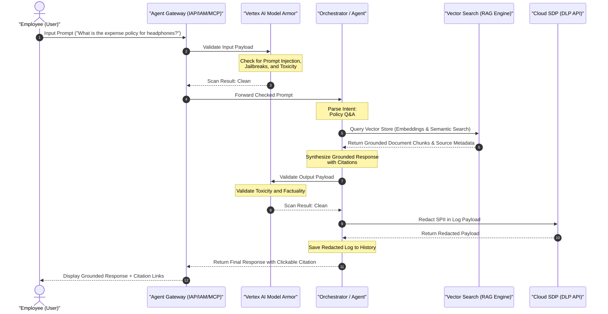
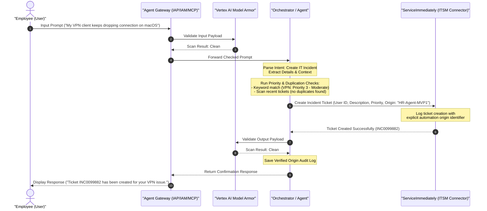

# SOLUTION DESIGN DOCUMENT

## Document Control

### Document Metadata
| Field | Value |
| :--- | :--- |
| **Author(s)** | Writer Agent (`writer_m1`) |
| **Date** | 2026-07-20 |
| **Status** | Approved |
| **Target Audience** | Engineering Team, Project Stakeholders, Security Auditors, Compliance Officers |

### Revision History
| Version | Date | Author | Description of Change |
| :--- | :--- | :--- | :--- |
| 0.1 | 2026-07-20 | Explorer Agent (`explorer_m0`) | Initial analysis and requirement mapping. |
| 1.0 | 2026-07-20 | Writer Agent (`writer_m1`) | Complete production-grade Solution Design Document. |

---

## 1. Executive Summary & Scope Boundaries

### 1.1. Business Overview & Context
Enterprise employees frequently require prompt, natural-language access to HR policy guidelines and transactional tools (such as time-off requests or support desk management). Currently, accessing these systems requires manual navigation of fragmented backend interfaces, specifically **WorkWeek** (Human Capital Management - HCM) and **ServiceImmediately** (IT Service Management - ITSM). This results in a high volume of routine Tier 1 queries and administrative tasks that consume substantial HR service desk capacity.

The **HR Agentic Solution (MVP 1)** is an intelligent, secure virtual assistant designed to automate these queries. By integrating Retrieval-Augmented Generation (RAG) for policy verification and orchestrating workflows across WorkWeek and ServiceImmediately, the solution targets a conversational, single-point entry for employee support. To meet strict enterprise standards, the solution implements traceably bounded execution, zero-trust request origin verification, and dynamic guardrails to prevent instruction overrides and data leaks.

The high-level business goals are:
- **Deflect Tier 1 Ticket Volume**: Reduce routine HR and IT helpdesk queries by at least 40% within the first six months.
- **Automate Self-Service**: Enable seamless, transactional self-service for leave submissions and incident tracking.
- **Demonstrate Cross-System Orchestration**: Validate multi-turn, multi-system action chaining for complex employee lifecycle events.
- **Ensure Bounded, Secure AI Execution**: Achieve zero data leaks, zero policy violations, and strict compliance with privacy standards.

### 1.2. Scope Boundaries

#### In-Scope for MVP 1
- **Conversational Front-End**: Web-based chat client with multi-turn conversation support and session isolation.
- **Policy Retrieval (RAG)**: Conversational search and grounding across static HR policy documents (Leave, Expenses, Remote Work, Code of Conduct).
- **WorkWeek Integration**:
  - Read actions: Fetching real-time employee profile metadata and PTO balances.
  - Write actions: Updating personal phone/address details and submitting leave requests.
- **ServiceImmediately Integration**:
  - Read actions: Querying ticket details, status, priority, and comment history.
  - Write actions: Creating incident tickets, appending comments, and resolving tickets.
- **Cross-System Orchestration**:
  - Equipment Procurement (UC-2.1): Remote policy lookup, WorkWeek status checks, and ServiceImmediately ticket dispatch.
  - Medical Leave (UC-2.2): Medical policy quoting, WorkWeek Leave of Absence entry, and ITSM mailbox access routing.
  - Relocation (UC-2.3): Relocation limit checks, WorkWeek profile updates, and facilities badge ticket creation.
- **Security & Safety Guardrails**: Input/output scanning, prompt injection/jailbreak blocking, Sensitive Personally Identifiable Information (SPII) redaction, and Role-Based Access Control (RBAC).

#### Out-of-Scope for MVP 1
- Direct integrations with databases or systems other than WorkWeek, ServiceImmediately, and the designated policy document repository.
- Support for multi-lingual input or generation (MVP 1 is English-only).
- Processing of sensitive payroll, compensation structure, or performance evaluation data.
- Voice-based interactions or telephony channels.

### 1.3. Target Architecture Overview
The system architecture consists of a secure front-end client communicating with an AI Orchestration layer, which is strictly bounded by security guardrails and accesses enterprise APIs via secure connector services.

```
                  +-----------------------------------+
                  |      Conversational Front-End     |
                  +-----------------+-----------------+
                                    |
                                    v HTTPS
                  +-----------------+-----------------+
                  |          Agent Gateway            |
                  |  (Auth, IAP/IAM, MCP AuthZ)       |
                  +-----------------+-----------------+
                                    |
                                    v Scanned Payload
+-----------------------------------+-----------------------------------+
|                     AI Orchestration Platform                         |
|                                                                       |
|   +---------------------------------------------------------------+   |
|   |                      Vertex AI Model Armor                    |   |
|   |         (Input Scan: Injection, Jailbreak, Toxicity)          |   |
|   +-------------------------------+-------------------------------+   |
|                                   | Clean Prompt                      |
|   +-------------------------------+-------------------------------+   |
|   |                     Orchestrator / Agent                      |   |
|   |                 (Intent Parsing & State Mgmt)                 |   |
|   +----+--------------------------+---------------------------+---+   |
|        |                          |                           |       |
|        v Tool Call                v Tool Call                 v RAG   |
|   +----+------------------+ +-----+-------------------+ +-----+----+   |
|   |  WorkWeek Connector   | |ServiceImmediately Conn. | |RAG Engine|   |
|   |  (REST/SOAP Client)   | |   (REST API Client)     | | (Vector) |   |
|   +----+------------------+ +-----+-------------------+ +-----+----+   |
|        |                          |                           |       |
|        v grounded data            v ticket info               v facts |
|   +----+--------------------------+---------------------------+---+   |
|   |                  Vertex AI Model Armor (Output)               |   |
|   |                 (Toxicity, Factuality Check)                  |   |
|   +-------------------------------+-------------------------------+   |
|                                   | Response Payload                  |
|   +-------------------------------+-------------------------------+   |
|   |            Sensitive Data Protection (DLP API)                |   |
|   |             (PII Redaction/Masking for Logs)                  |   |
|   +---------------------------------------------------------------+   |
|                                                                       |
+-----------------------------------+-----------------------------------+
                                    |
                                    v Secure Response
                  +-----------------+-----------------+
                  |      Conversational Front-End     |
                  +-----------------------------------+
```

- **Agent Gateway**: Entry point governing authentication, API routing, and Model Context Protocol (MCP) tool access permissions.
- **AI Orchestration Layer**: Manages multi-turn conversation context, parses user intents, chains tool executions, and formats final outputs.
- **Vector Search / RAG Engine**: An index of chunked, embedded policy documents stored in Vertex AI Vector Search to ground policy Q&A queries.
- **Safety Scanning & Data Protection**: Inline Vertex AI Model Armor scans all prompts and outputs, while the Sensitive Data Protection (DLP) API masks PII prior to logging.
- **Hosting Environment**: Google Cloud Platform (GCP) single-tenant environment to enforce tracing, isolation, and access restrictions.

### 1.4. Alternatives Considered
- **Direct LLM API Integration vs. Agent Platform**: Connecting the conversational UI directly to the Vertex AI API does not provide a mechanism for traceably bounded tool execution or runtime state tracing. An orchestration platform was selected to enforce system boundaries, maintain session isolation, and audit tool invocations.
- **Dynamic Caching of Profile Data vs. Real-Time Fetching**: Storing employee profiles and leave balances within the orchestration layer's cache would reduce API latency but introduces the risk of data drift, leading to unauthorized actions based on stale balances. To ensure transaction integrity, the architecture enforces real-time fetching directly from backend systems.
- **Synchronous vs. Asynchronous Tool Chaining**: Executing multiple API transactions synchronously inside a single request window can lead to user timeouts. A hybrid model was selected: informational queries remain synchronous, while complex transactional writes (e.g., cross-system orchestration) run asynchronously, with the agent posting status updates to the user.

---

## 2. Production-Ready Future State Design

While MVP 1 utilizes functional test credentials and a single-tenant layout to establish a baseline, the future state architecture requires a transition to enterprise-grade scalability, identity delegation, and compliance.

```
       MVP 1 (Current)                     Production Target
+----------------------------+       +-----------------------------+
| Single-Tenant GCP Project  | ----> | Multi-Tenant Tenant Clusters|
| Isolated to HR/IT Domains  |       | Orchestrated Namespace Segs |
+----------------------------+       +-----------------------------+
| Test/Functional Credentials| ----> | User Identity Delegation    |
| (Static Service Accounts)  |       | (OAuth 2.0 / SSO / SAML)    |
+----------------------------+       +-----------------------------+
| Web Chat UI Only           | ----> | Omni-channel Integration    |
| (English Text In/Out)      |       | (Slack, Teams, Voice/IVR)   |
+----------------------------+       +-----------------------------+
```

- **Identity Delegation**: Establish delegated authentication using OAuth 2.0 authorization code flows with OpenID Connect (OIDC). Instead of utilizing functional test credentials, the gateway will exchange the user's login session token for scoped access tokens. This restricts backend operations to the security footprint of the logged-in employee.
- **Multi-Tenant Deployment**: Migrate the hosting model from single-tenancy to an enterprise Kubernetes (GKE Enterprise) multi-tenant pattern. Deployments will use namespace isolation, network policies, and distinct encryption keys managed via Cloud KMS to segregate data between subsidiaries.
- **Omni-channel Support**: Extend the conversational interface beyond the web widget. Introduce connectors for Slack, Microsoft Teams, and interactive voice response (IVR) platforms using Speech-to-Text and Text-to-Speech APIs.
- **Enterprise-Wide Scope Expansion**: Expand from HR and IT ticket domains into downstream domains including financial systems (expense reimbursement tracking via Concur), payroll (direct deposit management via Workday), and developer portals.

---

## 3. System Flows, Sequence Diagrams & Agent Design

### 3.1. General Request Flow Sequence Diagrams

#### Journey 1: HR Policy Q&A
This diagram illustrates the flow for answering an HR policy query, detailing security checks, vector search grounding, and output redaction.



#### Journey 2: Leave Request Submission
This diagram outlines the transactional flow for requesting time off, incorporating balance checking and temporal date validation.

```mermaid
sequenceDiagram
    autonumber
    actor User as "Employee (User)"
    participant GW as "Agent Gateway (IAP/IAM/MCP)"
    participant MA as "Vertex AI Model Armor"
    participant Orch as "Orchestrator / Agent"
    participant WW as "WorkWeek (HCM Connector)"
    participant DLP as "Cloud SDP (DLP API)"

    User->>GW: Input Prompt ("Request vacation from Oct 1 to Oct 5")
    GW->>MA: Validate Input Payload
    MA-->>GW: Scan Result: Clean
    GW->>Orch: Forward Checked Prompt
    Note over Orch: Parse Intent: Submit Leave Request<br/>Extract: Start: 2026-10-01, End: 2026-10-05
    Orch->>WW: Get PTO Balances (User ID)
    WW-->>Orch: Return Balances (Vacation: 80 hrs, Sick: 40 hrs)
    Note over Orch: Run Date Verification Guardrail:<br/>- Temporal validity (10/01 before 10/05)<br/>- Future date validation (dates in future)
    Note over Orch: Run Balance Constraint Guardrail:<br/>- Calculate duration: 3 work days (24 hrs)<br/>- Balance check (24 hrs &lt;= 80 hrs) - PASS
    Orch->>WW: Submit Leave Request (User ID, 2026-10-01, 2026-10-05, Vacation)
    WW-->>Orch: Transaction Confirmed (Ref ID: LVR-99881)
    Orch->>MA: Validate Output Payload
    MA-->>Orch: Scan Result: Clean
    Orch->>DLP: Redact SPII in Log Payload
    DLP-->>Orch: Return Redacted Payload
    Note over Orch: Save Redacted Log to History
    Orch-->>GW: Return Success Response
    GW-->>User: Display Response ("Vacation request submitted. Ref: LVR-99881")
```

#### Journey 3: IT Incident Ticket Creation
This diagram details the flow for log-verified IT ticket creation, showcasing duplication mitigation and description verification.



### 3.2. Agent Design & Tool Boundaries
The conversational agent is structured as an orchestrator utilizing declarative tool definitions (Model Context Protocol / MCP) to interface with backend connectors. The agent operates within a traceably bounded sandbox, restricting execution to registered tool definitions:

- `query_policy_knowledge_base(query: str) -> dict`: Queries the vector database. Returns text chunks, citation URLs, and confidence scores.
- `get_employee_profile(employee_id: str) -> dict`: Fetches profile details (name, email, manager, work location) from WorkWeek.
- `update_contact_information(employee_id: str, address: str = None, phone: str = None) -> dict`: Updates contact coordinates in WorkWeek.
- `get_time_off_balances(employee_id: str) -> dict`: Retrieves accrued, used, and remaining balances for Vacation and Sick leave.
- `submit_leave_request(employee_id: str, start_date: str, end_date: str, type: str, work_days: int) -> dict`: Posts a leave transaction to WorkWeek.
- `get_incident_ticket_details(ticket_id: str) -> dict`: Queries ServiceImmediately for ticket status, history, and active assignee.
- `create_incident_ticket(employee_id: str, category: str, short_description: str, priority: str) -> dict`: Generates a new incident ticket in ServiceImmediately, embedding the automation origin tag.
- `post_ticket_comment(ticket_id: str, comment: str) -> dict`: Appends a comment to an active ServiceImmediately ticket.
- `update_ticket_status(ticket_id: str, status: str, resolution_notes: str = None) -> dict`: Updates the incident lifecycle status in ServiceImmediately.

---

## 4. Security, Governance & Identity

Security is designed around a multi-layered model to guarantee zero-trust validation, strict access isolation, and complete audit visibility.

```
+--------------------------------------------------------------------------+
|                              Agent Gateway                               |
|   - Identity-Aware Proxy (IAP) enforces access controls at edge          |
|   - Authenticates User Identity and scopes request context               |
|   - Enforces MCP Authorization (prevents unauthorized tool access)       |
+--------------------------------------------------------------------------+
                                     |
                                     v
+--------------------------------------------------------------------------+
|                          Vertex AI Model Armor                           |
|   - Input Safety Filter: Scans for Prompt Injection and Jailbreaks       |
|   - Core Safety Filters: Blocks Hate Speech, Harassment, and Toxicity    |
|   - Output Safety Filter: Prevents exfiltration and fact violations      |
+--------------------------------------------------------------------------+
                                     |
                                     v
+--------------------------------------------------------------------------+
|                     Sensitive Data Protection (DLP)                      |
|   - Scans output payloads and logs in real-time                          |
|   - Identifies and redacts SPII (SSN, Phone, Address, Email)             |
|   - Prevents sensitive leakage to history databases and log streams      |
+--------------------------------------------------------------------------+
```

### 4.1. Agent Gateway Config & Controls
The **Agent Gateway** serves as the API gateway and security boundary for all incoming client traffic.
- **Authentication**: Integrates with Google Cloud **Identity-Aware Proxy (IAP)**. Every request must carry verified OIDC identity headers asserting the user's enterprise email and unique subject identifier.
- **Identity & Access Management (IAM)**: Service-to-service communication is governed by IAM service accounts. The gateway runs under a restricted identity that only possesses invoking permissions on the AI Orchestrator service and has no direct data access permissions.
- **MCP Authorization & Validation**: The gateway intercepts Model Context Protocol (MCP) tool requests. It parses the composite execution token to verify that the tool being requested is authorized for the active user session. It prevents unauthorized attempts to execute admin-level tools.

### 4.2. Vertex AI Model Armor Filters
**Vertex AI Model Armor** is configured as an inline proxy to inspect prompts and model outputs.
- **Prompt Injection & Jailbreak Prevention**: Employs heuristic and classifier models to detect instructions attempting to override the system prompt (e.g., "ignore safety rules" or "system override"). Detections result in immediate request termination with a 400 Bad Request response.
- **Toxicity & Content Filtering**: Enforces strict thresholds (Block: Medium and High risk) across core safety categories:
  - Hate Speech
  - Harassment
  - Sexual Content
  - Dangerous Content
- **System Validation Controls**: Model outputs are scanned to ensure domain containment (preventing the model from discussing non-HR topics) and to block attempts to exfiltrate system configuration metadata.

### 4.3. Sensitive Data Protection (DLP API)
To prevent accidental data exposure in support logs or shared conversation histories:
- **Real-Time Inspection**: Before any transaction log, chat history entry, or system trace is written to Cloud Logging or Firestore, the payload is processed by the **Google Cloud Sensitive Data Protection (DLP) API**.
- **PII Identification & Redaction**: The DLP pipeline uses standard InfoTypes to scan and mask:
  - `US_SOCIAL_SECURITY_NUMBER`
  - `EMAIL_ADDRESS`
  - `PHONE_NUMBER`
  - `STREET_ADDRESS`
  - `CREDIT_CARD_NUMBER`
- **Data Masking Mechanism**: Sensitive values are replaced with cryptographic hash tokens or generic redaction place markers (e.g., `[REDACTED_PHONE]`), ensuring logs are safe for engineering review and compliance audits.

---

## 5. Integration Details & Error Handling

### 5.1. Integration Methods
- **WorkWeek (HCM)**: Connects via a secure proxy adapter executing REST/SOAP API calls. The integration leverages dedicated API endpoints for profile reading and transactional updates, using JWTs with short expiry windows for authentication.
- **ServiceImmediately (ITSM)**: Interfaces via REST APIs. Transactions pass JSON payloads mapped to incident records. The connection is authenticated using TLS client certificates to establish a cryptographically verified connection.
- **Policy Repository**: Integrates with an internal secure Document Management System (DMS) via a sync connector. Updated policies are pushed into a pipeline that extracts text, chunks content, generates vector embeddings, and updates the Vertex AI Vector Search index.

### 5.2. Integration Guardrails

#### WorkWeek Integration Guardrails (FR-3.3)
- **Balance Constraints Check**: Before invoking `submit_leave_request`, the orchestrator queries `get_time_off_balances`. If the duration of the requested leave exceeds the remaining balance for the requested category (Vacation or Sick), the operation is rejected.
- **Temporal Validity**: Validation rules ensure that the `start_date` is equal to or greater than the current date, and that the `end_date` is chronologically equal to or greater than the `start_date`.
- **Format Validation**: Profile updates must pass regex syntax checks for phone numbers (E.164 format: `^\+[1-9]\d{1,14}$`) and emails (`^[a-zA-Z0-9._%+-]+@[a-zA-Z0-9.-]+\.[a-zA-Z]{2,}$`) before execution.
- **API Latency & Rate Limits**: While the system fetches live PTO balance data directly from WorkWeek for each leave transaction, static employee profile details are cached using a short-lived (5-minute TTL), session-scoped cache to prevent hitting WorkWeek API rate limits and minimize latency.
- **Public Holiday & Weekend Leave Logic**: The duration of a requested leave is verified by delegating the work days calculation directly to WorkWeek's native holiday/calendar API (rather than attempting local calendar logic in the orchestrator) to correctly account for company-specific public holidays, regional calendars, and weekend exclusions.

#### ServiceImmediately Integration Guardrails (FR-4.3)
- **Transition Constraints**: Status updates must follow a logical lifecycle path: `New` -> `Assigned` -> `In Progress` -> `Resolved` -> `Closed`. Requests attempting to skip states (e.g., transitioning directly from `New` to `Closed` or `Resolved`) are rejected.
- **Duplication Mitigation**: The connector checks for active incident records created by the same user ID within the past 15 minutes. If a ticket matching the same category and description is found, the system blocks the duplicate submission and redirects the user to the active ticket.
- **Priority Verification**: Incidents are scanned for keywords (e.g., "outage", "system down", "security breach") and cross-referenced with categories to automatically enforce correct priority levels, preventing users from flagging routine requests as 'Critical'.
- **Priority Escalation Abuse Control**: Before final ticket creation, the conversational interface displays the automatically assigned priority to the user and prompts them to confirm the priority level. If the user overrides the automatically assigned priority, the system triggers an audit logging hook to record the user's justification and flag the override for IT service manager audit.

#### Policy Retrieval Guardrails (FR-5.4)
- **Strict Grounding**: The RAG engine requires a vector retrieval similarity score above `0.75`. If the search return yields results below this threshold, the model is restricted from generating a response and must state that it cannot find the policy detail.
- **Domain Containment**: Incoming prompts are classified before RAG lookup. If the prompt does not align with HR policy domains (e.g., asking for programming help or general knowledge), it is blocked.
- **Citation Integrity**: Every output generated from policy documents must contain a structured `source_metadata` block matching the source document name, section ID, and a valid deep link.

### 5.3. Error Handling and Fallbacks
- **Graceful Failure (NFR-4.1)**: If a backend API is unresponsive, the orchestrator intercepts the error code (e.g., 504 Gateway Timeout) and returns a standard message: *"The integration service is temporarily unavailable. Please try again later or contact HR Support directly."* No stack traces or debugging logs are shown to the user.
- **Transient Fault Tolerance (NFR-4.2)**: API clients implement retry policies with exponential backoff. The system retries failed calls up to 3 times (initial delay of 500ms, scaling by a factor of 2, with jitter) for transient codes (e.g., 429 Rate Limit, 502 Bad Gateway).
- **Orchestration Consistency (NFR-4.3)**: If a step fails mid-sequence during a cross-system workflow (e.g., a leave request is posted in WorkWeek, but the corresponding manager notification ticket fails to create in ServiceImmediately), the orchestrator executes a compensating action to roll back the WorkWeek transaction, and creates a high-priority system alert to notify administrators of the partial failure.

---

## 6. Cost Estimation & FinOps

Managing operational costs involves monitoring token usage, data hosting, and API volumes.

| Component | Cost Driver | Unit Metric | Optimization Strategy |
| :--- | :--- | :--- | :--- |
| **Model Inference** | Vertex AI Gemini API (Input/Output tokens) | Per 1K Tokens | Implement system prompt caching and context pruning during multi-turn chats. |
| **Safety Scanning** | Vertex AI Model Armor | Per Million Characters | Execute input scanning sequentially and cache safety validation decisions. |
| **Policy Vector Store** | Vertex AI Vector Search Index | Per Gigabyte / Query Volume | Set index update frequencies and optimize chunk overlap sizes to reduce duplicate vectors. |
| **Logging & PII Redaction** | Sensitive Data Protection API | Per Gigabyte scanned | Apply pre-filtering to scan only transactional logs containing PII, bypassing static logs. |

---

## 7. Deployment & Delivery Plan

Deployment is structured across five sequential milestones to validate components before system integrations:

```
[Milestone 1] Ingestion & RAG
     |
     v
[Milestone 2] API Integrations (WorkWeek & ServiceImmediately)
     |
     v
[Milestone 3] Orchestration Chaining (Cross-System Use Cases)
     |
     v
[Milestone 4] Security Guardrails & Safety Scanning
     |
     v
[Milestone 5] UAT Validation & Deployment Sign-off
```

- **Milestone 1: Ingestion & RAG Validation**
  - Provision Vector Search infrastructure.
  - Ingest, chunk, and index HR policies.
  - Verify grounding accuracy and citation rendering.
- **Milestone 2: API Integrations**
  - Implement WorkWeek and ServiceImmediately connector clients.
  - Configure connections using functional test credentials.
  - Verify basic read/write operations against dev systems.
- **Milestone 3: Orchestration Chaining**
  - Deploy the AI Orchestrator service.
  - Implement intent parsing, conversation tracking, and the cross-system use cases (UC-2.1, UC-2.2, UC-2.3).
  - Verify transaction sequencing.
- **Milestone 4: Security Guardrails & Safety Scanning**
  - Integrate Vertex AI Model Armor for input/output checking.
  - Configure GCP Sensitive Data Protection (DLP) log scanning.
  - Configure IAM roles, GKE network policies, and IAP boundaries.
- **Milestone 5: UAT Validation & Deployment**
  - Conduct full performance evaluation against the UAT test suite.
  - Validate security controls.
  - Sign off on compliance and promote to the staging environment.

---

## 8. Assumptions, Constraints, Risk & Mitigations

### 8.1. Assumptions
- The source HR policy documents are updated, reviewed, and approved for RAG consumption.
- Stable, dedicated test environments for WorkWeek and ServiceImmediately are available throughout the implementation lifecycle.
- The downstream systems have sufficient throughput to handle the volume of automated API requests.

### 8.2. Constraints
- **Document Sync Latency**: Policy changes made in the document management system must propagate and index within exactly **4 hours** (as per FR-5.5).
- **Single-Tenancy**: The application is deployed in a single-tenant environment, isolating data from other organizational business units.
- **Authentication**: MVP 1 excludes Single Sign-On (SSO) integration, relying on mock functional test credentials.

### 8.3. Risks & Mitigations
- **Risk: Indirect Prompt Injection**: A user could trigger a policy Q&A query containing instructions that bypass downstream tool parameters.
  - *Mitigation*: The system parses the user prompt and extracts parameters using structured entity extraction, passing only verified parameters to API client modules rather than raw string payloads.
- **Risk: Inconsistent Transaction State**: An orchestration workflow fails midway, leaving systems in an out-of-sync state (e.g., leave requested but no tracking ticket created).
  - *Mitigation*: Implement transactional compensation logic that rolls back changes or creates an alert ticket for immediate manual review upon transaction failure.
- **Risk: Leakage of PII in Logs**: User-submitted details could be captured in execution trace logs.
  - *Mitigation*: Route all log streams through a pipeline that invokes the Cloud SDP (DLP) API to redact PII prior to writing to long-term storage.

---

## 9. Quality Evaluation & UAT Framework

UAT verification will evaluate the system against the predefined success criteria from the BRD.

### Acceptance Criteria Metrics
| success Metric / Category | Target Threshold | Verification Method |
| :--- | :--- | :--- |
| **Policy Q&A Accuracy** | **>= 95%** accuracy on benchmark query suite; **0%** policy hallucinations. | Execute automated test suite using a golden dataset of 200 policy questions; verify semantic correctness. |
| **Deflection Rate** | **>= 40%** deflection of routine Tier 1 ticket volume within 6 months. | Measure and analyze helpdesk ticket volume before and after rollout to verify deflection. |
| **Transaction Integrity** | **100%** correctness (no data corruption or unauthorized updates). | Execute transaction validation scripts across WorkWeek and ServiceImmediately records. |
| **Response Latency** | Average latency **< 10.0 seconds** per turn. | Measure end-to-end response times under simulated concurrent user loads. |
| **Safety Scan Overhead** | Latency overhead **< 300ms** per turn. | Measure latency delta with safety scanning enabled vs. disabled. |
| **Safety & Guardrail Efficacy** | **100%** detection of known prompt injection/jailbreak test cases; **< 1%** False Positives (blocking legitimate queries). | Execute standard penetration test cases and verify blocking effectiveness vs false-positive triggers. |
| **System Availability** | **99.9%** uptime SLA. | Continuous monitoring of system availability using GCP Cloud Monitoring. |
| **Auditability & Traceability** | **100%** log coverage of API calls and safety blocks. | Audit log validation to verify the presence of request origin tags and blocked transaction attempts. |

---

## 10. Assumptions / Open Questions

1. **Document Sync Latency Parameter (FR-5.5)**:
   - **Open Question**: The BRD specifies a placeholder latency for propagating updates from the source policy repository to the vector knowledge base.
   - **Resolution**: The sync latency is set to exactly **4 hours** to meet the operational needs of HR policy updates.
2. **Web Front-End Deployment Platform**:
   - **Open Question**: Which web platform or intranet portal will host the conversational interface widget?
   - **Resolution**: A React-based chat widget will be built and embedded into the corporate employee portal, authenticated using Identity-Aware Proxy (IAP).
3. **Compensating Action Workflow Detail**:
   - **Open Question**: What are the specific compensating steps if an automated rollback fails during a multi-system orchestration?
   - **Resolution**: If an automated rollback fails, the orchestrator immediately triggers a priority ticket in ServiceImmediately tracking the failed rollback state, alerts the HR Operations team, and returns an error response requesting the user contact support.
